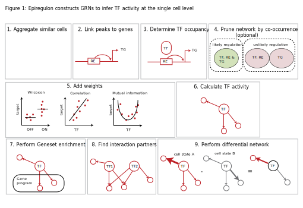
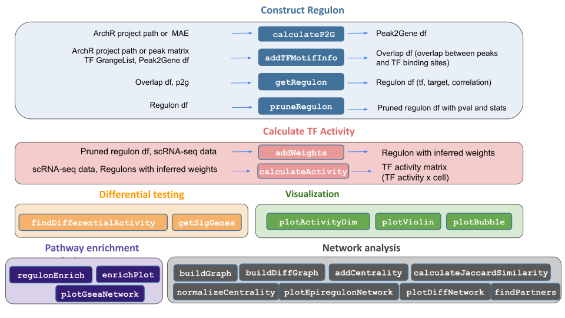

--- 
title: "Epiregulon documentation"
author: "Xiaosai Yao"
date: "`r Sys.Date()`"
site: bookdown::bookdown_site
documentclass: book
bibliography:
- book.bib
- packages.bib
description: |
  This book presents the Epiregulon package. We provide the tutorials showing different
  scenarions in which the package can be usd to analyse single-cell data. 
link-citations: yes
github-repo: "rstudio/bookdown-demo"
---


<!--chapter:end:index.Rmd-->

# Introduction

Gene regulatory networks model the underlying gene regulation hierarchies that drive gene expression and cell states. The main function of the epiregulon package is to construct gene regulatory networks and infer transcription factor (TF) activity in single cells by integration of scATAC-seq and scRNA-seq data and incorporation of public bulk TF ChIP-seq data.

Epiregulon assigns regulatory elements (REs) to their putative target genes (TGs) if the chromatin accessibility and gene expressions are highly correlated across cell clusters. Each regulatory element is then interrogated for TF occupancy based on a compilation of public TF ChIP-seq binding sites from [ChIP-Atlas](https://chip-atlas.org/) and [ENCODE](https://www.encodeproject.org/) TF ChIP-seq data. This maps out the preliminary TF-RE-TG regulatory relationships.

Further pruning of the gene regulatory network is necessary to remove spurious gene regulatory relationships not supported by the data, especially because the public ChIP-seq data was most certainly obtained in different cell lines or treatment conditions. In this case, we want to identify the most likely TF-RE-TG triplets. Here we apply tests of independence (binomial or chi-square tests) which identify TF-RE-TG triplets jointly occurring at probabilities deviating from the expected probabilities if these three events occur independently. In other words, we assume that a TF-RE-TG regulatory relationship holds true if expression of the TG, chromatin accessibility at RE and expression of the TG tend to co-exist in the same cells. While we recognize that there could be time delays between chromatin accessibility and the expression of target genes in true RE-TG relationships, we want to be conservative in our inferrence and rule out unsubstantiated TF-RE-TG relationships.

After network pruning, we would like to further estimate the strength of regulaton. This can be achieved using one of the four methods: 1) correlation between TF and TG expression, 2) mutual information between TF and TF expression, 3) effect size of the Wilcoxon test between target gene expression in cells jointly expressing all 3 elements vs cells that do not and 4) log fold difference of target gene expression in cells jointly expressing all 3 elements vs cells that do not. The activity of transcription factor is the weighted sum of all its target genes in which the weights correspond to the strength of regulation.
 
The target genes of TFs can be queried against known pathways to predict the functions of TFs. We can also perform differential network analysis between cluster-specific networks. Here we perform edge subtraction between two networks and the TFs are ranked by the degree centrality of the differential graphs. 


   

Current prerequisites for running epiregulon include pre-computed peak matrix,  gene expression matrix and dimensionality reduction. Epiregulon offers seamless integration with ArchR. Alternately, users can analyze their data using their favorite analysis tools and package their matrices into `MultiAssayExperiment` (See `scMultiome` package). The scATAC-seq experiment can be either paired or unpaired with the scRNA-seq dataset as long as they were already integrated. The final output of epiregulon is a matrix of TF activities where rows are individual TFs and columns are single cell indexes.




## Installation

Epiregulon is currently available on R/dev

```{r, results = "hide", warning = FALSE, message = FALSE, echo = FALSE}
library(epiregulon)
library(ArchR, quietly = TRUE)
```

Alternatively, you could install from gitlab

```{r setup_prostate, message=FALSE, eval=FALSE}
devtools::install_github(repo='xiaosaiyao/epiregulon')

library(epiregulon)
```

<!--chapter:end:01-intro.Rmd-->

# Multiome - ArchR workflow
This tutorial walks through the same dataset used in the "multiome tutorial - archR workflow". This is a dataset generated by infecting LNCaP cells with NKX2-1 and GATA6 to examine the effects of these TFs on AR activity.

## Installation

Epiregulon is currently available on R/dev

```{r, results='hide', message=FALSE}
library(epiregulon)
```

Alternatively, you could install from github

```{r setup, message=FALSE, eval=FALSE}
devtools::install_github(repo ='xiaosaiyao/epiregulon')

library(epiregulon)

```

## Data preparation

Single cell preprocessing needs to performed by user's favorite methods prior to using Epiregulon. The following components are required: <br>
1. Peak matrix from scATAC-seq <br>
2. Gene expression matrix from either paired or unpaired scRNA-seq. RNA-seq integration needs to be performed for unpaired dataset. <br>
3. Dimensionality reduction matrix from with either single modalities or joint scRNA-seq and scATAC-seq <br>

Multiome data can now be conveniently processed by ```initiate.archr``` and then ```gp.sa.archr``` to obtain peak matrices. Finally, the archR project can be uploaded into DatasetDB as a MultiAssayExperiment object using ```maw.archr::importArchr``` or ```maw.archr::create.mae.with.multiple.sces.from.archr``` 


```{r}
# load the MAE object
library(scMultiome)

mae <- scMultiome::reprogramSeq()

# peak matrix
PeakMatrix <- mae[["PeakMatrix"]]

# expression matrix
GeneExpressionMatrix <- mae[["GeneExpressionMatrix"]]
rownames(GeneExpressionMatrix) <- rowData(GeneExpressionMatrix)$name
assay(GeneExpressionMatrix) <- as(log2(assay(GeneExpressionMatrix)+1), "CsparseMatrix")

# dimensional reduction matrix
reducedDimMatrix <- reducedDim(mae[['TileMatrix500']], "LSI_ATAC")

```
Visualize singleCellExperiment by UMAP
```{r}
# transfer UMAP_combined from TileMatrix to GeneExpressionMatrix
reducedDim(GeneExpressionMatrix, "UMAP_Combined") <- reducedDim(mae[['TileMatrix500']], "UMAP_Combined")
scater::plotReducedDim(GeneExpressionMatrix, 
                       dimred = "UMAP_Combined", 
                       text_by = "Clusters", 
                       colour_by = "Clusters")

```

## Quick start

### Retrieve bulk TF ChIP-seq binding sites 

First, we retrieve the information of TF binding sites collected from Cistrome and ENCODE ChIP-seq, which are hosted on Genomitory. Currently, human genomes HG19 and HG38 and mouse mm10 are available. 

```{r getTFMotifInfo}
grl <- getTFMotifInfo(genome = "hg38")
head(grl)
```

### Link ATAC-seq peaks to target genes

Next, we compute peak to gene correlations using a custom algorithm that has similar performance to ArchR's P2G function.

```{r calculateP2G}
set.seed(1010)
p2g <- calculateP2G(peakMatrix = PeakMatrix, 
                    expMatrix = GeneExpressionMatrix, 
                    reducedDim = reducedDimMatrix,
                    exp_assay = "normalizedCounts")

p2g

```


### Add TF motif binding to peaks

The next step is to add the TF binding information by overlapping regions of the peak matrix with the bulk chip-seq database loaded in 2. The user can supply either an archR project path and this function will retrieve the peak matrix, or a peakMatrix in the form of a Granges object or RangedSummarizedExperiment.

```{r addTFMotifInfo}

overlap <- addTFMotifInfo(grl = grl, p2g = p2g, peakMatrix = PeakMatrix)
head(overlap)
```

### Generate regulons

A long format dataframe, representing the inferred regulons, is then generated. The dataframe consists of three columns:

* tf (transcription factor)
* target gene
* peak to gene correlation between tf and target gene

```{r, warning=FALSE, getRegulon}

regulon <- getRegulon(p2g = p2g, overlap = overlap, aggregate = FALSE)
regulon

```

### Network pruning (highly recommended)

Epiregulon prunes the network by performing tests of independence on the observed number of cells jointly expressing transcription factor (TF), regulatory element (RE) and target gene (TG) vs the expected number of cells if TF/RE and TG are independently expressed. We implement two tests, the binomial test and the chi-square test. In the binomial test, the expected probability is P(TF, RE) * P(TG), and the number of trials is the total number of cells, and the observed successes is the number of cells jointly expressing all three elements. In the chi-square test, the expected probability for having all 3 elements active is also P(TF, RE) * P(TG) and the probability otherwise is 1- P(TF, RE) * P(TG). The observed cell count for the active category is the number of cells jointly expressing all three elements, and the cell count for the inactive category is n - n_triple.

We calculate cluster-specific p-values if users supply cluster labels. This is useful if we are interested in cluster-specific networks. The pruned regulons can then be used to visualize differential networks for transcription factors of interest. See section on differential networks.


```{r network pruning, results = "hide", message = FALSE}

pruned.regulon <- pruneRegulon(expMatrix = GeneExpressionMatrix,
                               exp_assay = "normalizedCounts",
                               peakMatrix = PeakMatrix,
                               peak_assay = "counts",
                               test = "chi.sq",
                               regulon,
                               clusters = GeneExpressionMatrix$Clusters,
                               prune_value = "pval",
                               regulon_cutoff = 0.05
                               )

pruned.regulon
```

### Add Weights

While the `pruneRegulon' function provides statistics on the joint occurrence of TF-RE-TG, we would like to further estimate the strength of regulation. Biologically, this can be interpreted as the magnitude of gene expression changes induced by transcription factor activity. Epiregulon estimates the regulatory potential using one of the four measures: 1) correlation between TF and target gene expression, 2) mutual information between the TF and target gene expression, 3) Wilcoxon test statistics of target gene expression in cells jointly expressing all 3 elements vs cells that do not, or 4) log 2 fold difference of target gene expression in cells jointly expressing all 3 elements vs cells that do not. 

Three measures (correlation, Wilcoxon statistics and log 2 fold difference) give both the magnitude and directionality of changes whereas mutational information is always positive. The correlation and mutual information statistics are computed on the grouped pseudobulks by user-supplied cluster labels, whereas the Wilcoxon and log fold change group cells based on the joint expression of TF, RE and TG in each single cell. 

```{r addWeights, results = "hide", warning = FALSE, message = FALSE}

regulon.w <- addWeights(regulon = pruned.regulon,
                        expMatrix  = GeneExpressionMatrix,
                        exp_assay  = "normalizedCounts",
                        peakMatrix = PeakMatrix,
                        peak_assay = "counts",
                        clusters = GeneExpressionMatrix$Clusters,
                        block_factor = NULL,
                        tf_re.merge = TRUE,
                        method = "corr")

regulon.w

```

### (Optional) Annotate with TF motifs

So far the gene regulatory network was constructed from TF ChIP-seq exclusively. Some users would prefer to further annotate the regulatory elements with the presence of motifs. We provide an option to annotate peaks with motifs from the Cisbp database. If no motifs are present for this particular factor (as in the case of co-factors or chromatin modifiers), we return NA. If motifs are available for a factor and the RE contains a motif, we return 1. If motifs are available and the RE does not contain a motif, we return 0. 

If the user has already performed motif annotation with ArchR, we could also retrieve the results directly. See `?addMotifScore`

```{r addMotifScore}

regulon.w.motif <- addMotifScore(regulon = regulon.w,
                                 peaks = rowRanges(PeakMatrix),
                                 species = "human",
                                 genome = "hg38")

# if desired, set weight to 0 if no motif is found
regulon.w.motif$weight[regulon.w.motif$motif == 0] <- 0
```

### Calculate TF activity 

Finally, the activities for a specific TF in each cell are computed by averaging expressions of target genes linked to the TF weighted by the test statistics of choice, chosen from either correlation, mutual information, Wilcoxon test statistics or log fold change. 
$$y=\frac{1}{n}\sum_{i=1}^{n} x_i * weights_i$$
where $y$ is the activity of a TF for a cell
$n$ is the total number of targets for a TF
$x_i$ is the log count expression of target i where i in {1,2,...,n}
$weights_i$ is the weight of TF and target i

```{r calculateActivity, results = "hide"}
score.combine <- calculateActivity(expMatrix = GeneExpressionMatrix,
                                   regulon = regulon.w, 
                                   mode = "weight", 
                                   method = "weightedMean", 
                                   exp_assay = "normalizedCounts",
                                   normalize = FALSE)

```

### Perform differential activity
```{r differential}
markers <- findDifferentialActivity(activity_matrix = score.combine, 
                                    groups = GeneExpressionMatrix$hash_assignment, 
                                    pval.type = "some", 
                                    direction = "up", 
                                    test.type = "t")
```

Take the top TFs
```{r}
markers.sig <- getSigGenes(markers, topgenes = 5 )

```
### Visualize the results

First visualize the known differential TFs by bubble plot
```{r visualization}
plotBubble(activity_matrix = score.combine, 
           tf = c("NKX2-1","GATA6","FOXA1","FOXA2", "AR"), 
           clusters = GeneExpressionMatrix$hash_assignment)
```

Then visualize the most differential TFs by clusters
```{r}

plotBubble(activity_matrix = score.combine, 
           tf = markers.sig$tf, 
           clusters = GeneExpressionMatrix$hash_assignment)

```

Visualize the known differential TFs by violin plot. Note there is no activity calculated for SOX2 because the expression of SOX2 is 0 in all cells.

```{r}
plotActivityViolin(activity_matrix = score.combine, 
                   tf = c("NKX2-1","GATA6","FOXA1","FOXA2", "AR"), 
                   clusters = GeneExpressionMatrix$hash_assignment)
```

Visualize the known differential TFs by UMAP
```{r, fig.height = 8, fig.width = 12}
plotActivityDim(sce = GeneExpressionMatrix, 
                activity_matrix = score.combine, 
                tf = c("NKX2-1","GATA6","FOXA1","FOXA2", "AR"), 
                dimtype = "UMAP_Combined", 
                label = "Clusters", 
                point_size = 1, 
                ncol = 3)

```

In contrast, the gene expression of the TFs is very sparse
```{r, fig.height = 8, fig.width = 12}

plotActivityDim(sce = GeneExpressionMatrix, 
                activity_matrix = counts(GeneExpressionMatrix), 
                tf = c("NKX2-1","GATA6","FOXA1","FOXA2", "AR"), 
                dimtype = "UMAP_Combined", 
                label = "Clusters", 
                point_size = 1, 
                ncol = 3,
                limit = c(0,2),
                colors = c("grey","blue"),
                legend.label = "GEX")
```

Visualize the gene expression of the regulons by heatmap
```{r}
plotHeatmapRegulon(sce=GeneExpressionMatrix,
                   tfs=c("GATA6","NKX2-1"),
                   regulon=regulon.w,
                   regulon_cutoff=0.1,
                   downsample=1000,
                   cell_attributes="Clusters",
                   col_gap="Clusters",
                   exprs_values="counts",
                   name="regulon heatmap")
```

```{r}
plotHeatmapActivity(activity=score.combine,
                    sce=GeneExpressionMatrix,
                    tfs=rownames(score.combine),
                    downsample=5000,
                    cell_attributes="Clusters",
                    col_gap="Clusters",
                    name = "Activity")
```
### Geneset enrichment

Sometimes we are interested to know what pathways are enriched in the regulon of a particular TF. We can perform geneset enrichment using the enricher function from [clusterProfiler](http://yulab-smu.top/biomedical-knowledge-mining-book/universal-api.html).

```{r enrichment, fig.height = 10, fig.width = 12}
#retrieve genesets
H <- EnrichmentBrowser::getGenesets(org = "hsa", 
                                    db = "msigdb", 
                                    cat = "H", 
                                    gene.id.type = "SYMBOL" )
C2 <- EnrichmentBrowser::getGenesets(org = "hsa", 
                                     db = "msigdb", 
                                     cat = "C2",
                                     gene.id.type = "SYMBOL" )
C6 <- EnrichmentBrowser::getGenesets(org = "hsa", 
                                     db = "msigdb", 
                                     cat = "C6",
                                     gene.id.type = "SYMBOL" )

#combine genesets and convert genesets to be compatible with enricher
gs <- c(H, C2, C6)
gs.list <- do.call(rbind,lapply(names(gs), function(x) 
  {data.frame(gs=x, genes=gs[[x]])}))

enrichresults <- regulonEnrich(TF = c("GATA6","NKX2-1"), 
                               regulon = regulon.w, 
                               weight = "weight",
                               weight_cutoff = 0, 
                               genesets = gs.list)

#plot results
enrichPlot(results = enrichresults )
```
### Network analysis

We can visualize the genesets as a network
```{r plot gsea network}

plotGseaNetwork(tf = names(enrichresults), 
                enrichresults = enrichresults,
                p.adj_cutoff = 0.1,
                ntop_pathways = 10)


```

### Differential networks

We are interested in understanding the differential networks between two conditions and determining which transcription factors account for the differences in the topology of networks. The pruned regulons with cluster-specific test statistics computed by `pruneRegulon` can be used to generate cluster-specific networks based on user-defined cutoffs and to visualize differential networks for transcription factors of interest. In this dataset, the GATA6 gene was only expressed in cluster 1 (C1) and NKX2-1 was only expressed in cluster 3 (C3). If we visualize the target genes of GATA6, we can see that C1 has many more target genes of GATA6 compared to C5, a cluster that does not express GATA6. Similarly, NKX2-1 target genes are confined to C3 which is the only cluster that exogenously expresses NKX2-1.

```{r differential networks}

plotDiffNetwork(pruned.regulon,
                cutoff = 1,
                tf = c("GATA6"),
                weight = "stats",
                clusters = c("C1","C5"),
                layout = "stress")

plotDiffNetwork(pruned.regulon,
                cutoff = 1,
                tf = c("NKX2-1"),
                weight = "stats",
                clusters = c("C3","C5"),
                layout = "stress")


```

We can also visualize how transcription factors relate to other transcription factors in each cluster.
```{r}
selected <- which(pruned.regulon$stats[,"C1"]> 1 & 
                    pruned.regulon$tf %in% c("GATA6","FOXA1","AR"))
C1_network <- buildGraph(pruned.regulon[selected,], 
                         weights = "stats", 
                         cluster = "C1")
selected <- which(pruned.regulon$stats[,"C5"]> 1 & 
                    pruned.regulon$tf %in% c("GATA6","FOXA1","AR"))
C5_network <- buildGraph(pruned.regulon[selected,], 
                         weights = "stats", 
                         cluster = "C5")
plotEpiregulonNetwork(C1_network,
                      layout = "sugiyama",
                      tfs_to_highlight = c("GATA6","FOXA1","AR")) + 
  ggplot2::ggtitle ("C1")

plotEpiregulonNetwork(C5_network,
                      layout = "sugiyama",
                      tfs_to_highlight = c("GATA6","FOXA1","AR")) + 
  ggplot2::ggtitle ("C5")

```
To systematically examine the differential network topology between two clusters, we perform an edge subtraction between two graphs, using weights computed by `pruneRegulon`. We then calculate the degree centrality of the weighted differential graphs and if desired, normalize the differential centrality against the total number of edges. The default normalization function is `sqrt` as it preserves both the difference in the number of edges (but scaled by sqrt) and the differences in the weights. If the user only wants to examine the differences in the averaged weights, the `FUN` argument can be changed to `identity`. Finally, we rank the transcription factors by (normalized) differential centrality.


```{r}

# rank by differential centrality
C1_network <- buildGraph(pruned.regulon, weights = "stats", cluster="C1")
C5_network <- buildGraph(pruned.regulon, weights = "stats", cluster="C5")

diff_graph <- buildDiffGraph(C1_network, C5_network)
diff_graph <- addCentrality(diff_graph)
diff_graph <- normalizeCentrality(diff_graph)
rank_table <- rankTfs(diff_graph)

library(ggplot2)
ggplot(rank_table, aes(x = rank, y = centrality)) +
    geom_point() +
    ggrepel::geom_text_repel(data = head(rank_table, 5), aes(label = tf)) +
    theme_classic()


```

## Session Info

```{r}
sessionInfo()
```

<!--chapter:end:02-multiome.mae.Rmd-->

# Hematopoeisis tutorial - MAE

In this vignette, we used a dataset from the ArchR [tutorial](https://www.archrproject.com/bookdown/index.html). Prior to using epiregulon, this dataset has been fully preprocessed in ArchR, and converted to a `MultiAssayExperiment` using `epireglon::archr2MAE`. The MAE object was uploaded to `scMultiome` for full reproducibility. In this dataset, scRNAseq and scATACseq were unpaired and integrated by the `ArchR::addGeneIntegrationMatrix` function. 


## Installation

Epiregulon is currently available on R/dev

```{r, message=FALSE}
library(epiregulon)
#devtools::load_all("/gstore/project/lineage/xiaosai/epiregulon")
```

If you would like to install from gitlab, 

```{r, message=FALSE, eval=FALSE}
devtools::install_github(repo='xiaosaiyao/epiregulon')
library(epiregulon)
```

## Data preparation

Download the example dataset from `r BiocStyle::Biocpkg("scMultiome")` package

```{r}
mae <- scMultiome::hematopoiesis()

# Load peak matrix
PeakMatrix <- mae[["PeakMatrix"]]

# Load expression matrix
GeneExpressionMatrix <- mae[["GeneIntegrationMatrix"]]

# Add gene symbols to rownames
rownames(GeneExpressionMatrix) <- rowData(GeneExpressionMatrix)$name

# Transfer dimensionality reduction matrix to GeneExpression
reducedDim(GeneExpressionMatrix, "IterativeLSI") <- 
  reducedDim(mae[['TileMatrix500']], "IterativeLSI")
reducedDim(GeneExpressionMatrix, "UMAP") <- 
  reducedDim(mae[['TileMatrix500']], "UMAP")

```


Visualize the data
```{r}

scater::plotReducedDim(GeneExpressionMatrix, 
                       dimred = "UMAP", 
                       text_by = "Clusters2", 
                       colour_by = "Clusters2",
                       point_size = 0.3,
                       point_alpha = 0.3)

```

## Quick start

### Retrieve bulk TF ChIP-seq binding sites 

First, we retrieve the information of TF binding sites collected from Cistrome and ENCODE ChIP-seq. Currently, human genomes hg19 and hg38 and mouse genome mm10 are available
```{r}
grl <- getTFMotifInfo(genome = "hg19")
head(grl)

```

### Link ATACseq peaks to target genes

Next, we compute peak to gene correlations using a custom algorithm that has similar performance to ArchR's P2G function. Wherever possible, use a multidimensional dimensionality reduction matrix such as LSI or PCA instead of UMAP or TSNE since the former provides a more accurate estimate of cell similarity.

```{r}

set.seed(1010)
p2g <- calculateP2G(peakMatrix = PeakMatrix, 
                    expMatrix = GeneExpressionMatrix, 
                    exp_assay = "normalizedCounts",
                    reducedDim = reducedDim(GeneExpressionMatrix, "IterativeLSI"))

p2g
```

### Add TF motif binding to peaks

The next step is to add the TF motif binding information by overlapping the regions of the peak matrix with the bulk chip-seq database.
```{r}
overlap <- addTFMotifInfo(grl = grl, p2g = p2g, peakMatrix = PeakMatrix)
head(overlap)
```

### Generate regulons

A long format dataframe, representing the inferred regulons, is then generated. The dataframe consists of three columns:

* tf (transcription factor)
* target gene
* peak to gene correlation between tf and target gene

```{r}
regulon <- getRegulon(p2g, overlap, aggregate=FALSE)
head(regulon)
```

### Prune network

Epiregulon prunes the network by performing tests of independence on the observed number of cells jointly expressing transcription factor (TF), regulatory element (RE) and target gene (TG) vs the expected number of cells if TF/RE and TG are independently expressed. We implement two tests, the binomial test and the chi-square test. In the binomial test, the expected probability is P(TF, RE) * P(TG), and the number of trials is the total number of cells, and the observed successes is the number of cells jointly expressing all three elements. In the chi-square test, the expected probability for having all 3 elements active is also P(TF, RE) * P(TG) and the probability otherwise is 1- P(TF, RE) * P(TG). The observed cell count for the active category is the number of cells jointly expressing all three elements, and the cell count for the inactive category is n - n_triple.


We calculate cluster-specific p-values if users supply cluster labels. This is useful if we are interested in cluster-specific networks. The pruned regulons can then be used to visualize differential networks for transcription factors of interest. See section on differential networks.


```{r}

pruned.regulon <- pruneRegulon(expMatrix = GeneExpressionMatrix,
                               exp_assay = "normalizedCounts",
                               peakMatrix = PeakMatrix,
                               peak_assay = "counts",
                               regulon = regulon,
                               prune_value = "pval",
                               regulon_cutoff = 0.05,
                               clusters = GeneExpressionMatrix$Clusters2,
                               exp_cutoff = NULL)

```


### Add Weights

While the `pruneRegulon' function provides statistics on the joint occurrence of TF-RE-TG, we would like to further estimate the strength of regulation. Biologically, this can be interpreted as the magnitude of gene expression changes induced by transcription factor activity. Epiregulon estimates the regulatory potential using one of the four measures: 1) correlation between TF and target gene expression, 2) mutual information between the TF and target gene expression, 3) Wilcoxon test statistics of target gene expression in cells jointly expressing all 3 elements vs cells that do not, or 4) log 2 fold difference of target gene expression in cells jointly expressing all 3 elements vs cells that do not. 

Three measures (correlation, Wilcoxon statistics and log 2 fold difference) give both the magnitude and directionality of changes whereas mutational information is always positive. The correlation and mutual information statistics are computed on grouped pseudobulks by user-supplied cluster labels and yield a single weight across all clusters per each TF-RE-target triplet. In contrast, Wilcoxon and log fold change methods group cells based on the joint expression of TF, RE and TG in each single cell or in cell aggregates. Cell aggregation uses a default value of 10 cells and can help overcome sparsity and speed up computation. If cluster labels are provided, we can obtain weights of individual clusters and all cells combined. In this example, we apply Wilcoxon test on cell aggregates of 10 cells.  
 
```{r}

regulon.w <- addWeights(regulon = pruned.regulon,
                        expMatrix  = GeneExpressionMatrix,
                        exp_assay  = "normalizedCounts",
                        peakMatrix = PeakMatrix,
                        peak_assay = "counts",
                        clusters = GeneExpressionMatrix$Clusters2,
                        aggregateCells = TRUE,
                        method = "wilcox",
                        useDim = "IterativeLSI")

regulon.w

#saveRDS(regulon, "/gstore/project/lineage/manuscript/epiregulon/OUTPUT/regulon.rds")
#saveRDS(regulon.w, "/gstore/project/lineage/manuscript/epiregulon/OUTPUT/regulon.w.rds")

```


### Calculate TF activity 

Finally, the activities for a specific TF in each cell are computed by averaging the weighted expressions of target genes linked to the TF weighted. 
$$y=\frac{1}{n}\sum_{i=1}^{n} x_i * weight_i$$
where $y$ is the activity of a TF for a cell
$n$ is the total number of targets for a TF
$x_i$ is the log count expression of target i where i in {1,2,...,n}
$weight_i$ is the weight of TF and target i

```{r}
score.combine <- calculateActivity(expMatrix = GeneExpressionMatrix, 
                                   regulon = regulon.w, 
                                   mode = "weight", 
                                   method = "weightedMean", 
                                   exp_assay = "normalizedCounts")
head(score.combine[1:5,1:5])
```

### Differential TF activity test

We can next determine which TFs exhibit differential activities across cell clusters/groups via the `findDifferentialActivity` function. This function depends on `findMarkers` function from `r BiocStyle::Biocpkg("scran")` package. 

```{r}
markers  <- findDifferentialActivity(activity_matrix = score.combine, 
                                    groups = GeneExpressionMatrix$Clusters2, 
                                    pval.type = "some", 
                                    direction = "up", 
                                    test.type = "t")
```

getSigGenes compiles the different test results into a single dataframe and enables user to supply their desired cutoffs for significance and variable to order by.

```{r}
markers.sig <- getSigGenes(markers, topgenes = 3 )

```
### Visualizing TF activities

Epiregulon also provides multiple options for visualizing the inferred TF activities by reduced dimensional space

tSNE or UMAP plots:
```{r}

tfs_interest <- c("EBF1","GATA3", "SPI1", "GATA2")
plotActivityDim(sce = GeneExpressionMatrix, 
                activity_matrix = score.combine[tfs_interest,], 
                tf = tfs_interest, 
                dimtype = "UMAP",
                nrow=2,
                ncol=2,
                point_size=0.1,
                rasterise = TRUE)
```
We can compare the activity with gene expression of the same TFs.

```{r}

#options(ggrastr.default.dpi=300)
plotActivityDim(sce = GeneExpressionMatrix, 
                activity_matrix = assay(GeneExpressionMatrix, "normalizedCounts")[tfs_interest,], 
                tf = tfs_interest, 
                dimtype = "UMAP",
                nrow=2,
                ncol=2,
                legend.label = "Gex",
                colors = c("grey","blue"),
                #limit = c(0,2),
                point_size=0.1,
                rasterise = TRUE)
```


We can also plot violin plot to visualize TF activity.
```{r}
plotActivityViolin(activity_matrix = score.combine, 
                   tf = tfs_interest, 
                   clusters = GeneExpressionMatrix$Clusters2,
                   nrow=2,
                   ncol=2)
```
We plot violin plot to visualize TF gene expression.

```{r}
plotActivityViolin(activity_matrix = assay(GeneExpressionMatrix, "normalizedCounts")[tfs_interest,],  
                   tf = tfs_interest, 
                   clusters = GeneExpressionMatrix$Clusters2,
                   nrow=2,
                   ncol=2,
                   legend.label = "gene expression")
```

We can visualize the different TFs in a bubble plot:
```{r}
plotBubble(activity_matrix = score.combine, 
           tf = tfs_interest, 
           GeneExpressionMatrix$Clusters2, 
           bubblesize = "FDR")
```

We visualize the top differential TFs based on activity.

```{r,fig.height=9}
plotBubble(activity_matrix = score.combine, 
           tf = markers.sig$tf, 
           GeneExpressionMatrix$Clusters2, 
           bubblesize = "FDR")
```


### Geneset enrichment

Sometimes we are interested to know what pathways are enriched in the regulon of a particular TF. We can perform geneset enrichment using the enricher function from [clusterProfiler](http://yulab-smu.top/biomedical-knowledge-mining-book/universal-api.html).

Here we first download Hallmark and C2 signatures from hallmark and then perform gene set enrichment of the known lineage factors. As expected, EBF1 is consistent with a B cell lineage factor, GATA3 and RUNX3 with lymphoid lineage and SPI1 with myeloid lineage.

```{r enrichment_hematopoeisis, fig.width=12}
#retrieve genesets
H <- EnrichmentBrowser::getGenesets(org = "hsa", 
                                    db = "msigdb", 
                                    cat = "H", 
                                    gene.id.type = "SYMBOL" )
C2 <- EnrichmentBrowser::getGenesets(org = "hsa", 
                                     db = "msigdb", 
                                     cat = "C2",
                                     gene.id.type = "SYMBOL" )


#combine genesets and convert genesets to be compatible with enricher
gs <- c(H, C2)
gs.list <- do.call(rbind,lapply(names(gs), function(x) 
  {data.frame(gs=x, genes=gs[[x]])}))

enrichresults <- regulonEnrich(TF = tfs_interest, 
                               regulon = regulon.w, 
                               weight = "weight",
                               weight_cutoff = 0, 
                               genesets = gs.list)

#plot results
enrichPlot(results = enrichresults, ncol=2)
```
## Differential Network analysis

In addition to looking at the summed TF activity, a second approach to investigate differential TF activity is to compare and contrast target genes or network topology. In this example, we know that EBF1 is a B cell lineage factor. If we plot the differential network of EBF1 using the regulon with cluster-specific weights, we can see that EBF1 has many more targets in PreB cells than it has in CD4 memory cells. 

```{r differential networks hematopoeisis}

plotDiffNetwork(regulon.w,
                cutoff = 0,
                tf = c("EBF1"),
                weight = "weight",
                clusters = c("PreB","CD4.M"),
                layout = "stress")

```
Sometimes, we are interested to identify interaction partners of the TFs of interest. This can be achieved by comparing the overlap of the targets genes for all the TFs and identify the most similar TFs by Jaccard similarity. To illustrate this function, we take a look at the top most similar 20 TFs to EBF1, and we successfully identify PAX5 as the most similar TF. Both PAX5 and EBF1 are important factors for B cell development (https://www.nature.com/articles/ni.2641).

```{r}
# construct a graph of the preB cells
preB_network <- buildGraph(regulon.w, weights = "weight", cluster="PreB")

# compute a similarity matrix of all TFs
similarity_score <- calculateJaccardSimilarity(preB_network)

# Focus on EBF1
similarity_score_EBF1 <- similarity_score[, "EBF1"]
similarity_df <- data.frame(similarity = head(sort(similarity_score_EBF1, 
                                                   decreasing = TRUE),20),
                            TF = names(head(sort(similarity_score_EBF1,
                                                 decreasing = TRUE),20)))

similarity_df$TF <- factor(similarity_df$TF, levels = rev(unique(similarity_df$TF)))

# plot top TFs most similar to EBF1
topTFplot <- ggplot(similarity_df, aes(x=TF, y=similarity)) +
  geom_bar(stat="identity") +
  coord_flip() +
  ggtitle("EBF1 similarity") +
  theme_classic()

print(topTFplot)

```


In order to convince ourselves that our differential network is statistically significant, we permute the edges and obtain a background graph from averaging many iterations. Here, we plot the differential network graph subtracted by permuted graphs. 
```{r}

# create a permuted graph by rewiring the edges 100 times
permute_matrix <- permuteGraph(preB_network, "EBF1", 100, p=1)
permute_matrix <- permute_matrix[names(similarity_score_EBF1),]
diff_matrix <- similarity_score_EBF1-rowMeans(permute_matrix)

diff_matrix_df <- data.frame(similarity = head(sort(diff_matrix, 
                                                    decreasing = TRUE),20),
                            TF = names(head(sort(diff_matrix,
                                                 decreasing = TRUE),20)))

diff_matrix_df$TF <- factor(diff_matrix_df$TF, levels = rev(unique(diff_matrix_df$TF)))

# plot top TFs most similar to EBF1
topTFplot <- ggplot(diff_matrix_df, aes(x=TF, y=similarity)) +
            geom_bar(stat="identity") +
            coord_flip() +
            ggtitle("background subtracted EBF1 similarity ") +
            theme_classic()
print(topTFplot)

# obtain empirical p-values
p_matrix <- rowMeans(apply(permute_matrix, 2, function(x) {x > similarity_score_EBF1}))
p_matrix[names(head(sort(diff_matrix,decreasing = TRUE),20))]
```


Next, we are interested to compare the networks of two cell types, in this case, CD4 memory cells (CD4.M) vs Monocytes (mono) cells. We build an edge subtracted graph and then calculate the degree centrality of the subtracted graph. We normalize centrality using the default square root function. The top 5 most positive TFs represent lineage factors more active in NK cells whereas the bottom 5 TFs present lineage factors enriched in CD4. We successfully identified the myeloid factor SPI1 to be associated with monocytes and Th1 factor TBX21 to be associated with CD4 cells.

```{r}
# construct a graph of the CD4.M and NK cells respectively
CD4.M_network <- buildGraph(regulon.w, weights = "weight", cluster="CD4.M")
Mono_network <- buildGraph(regulon.w, weights = "weight", cluster="Mono")

# construct a difference graph
diff_graph <- buildDiffGraph( Mono_network,CD4.M_network, abs_diff = FALSE)
diff_graph <- addCentrality(diff_graph)
diff_graph <- normalizeCentrality(diff_graph)
rank_table <- rankTfs(diff_graph)

library(ggplot2)
ggplot(rank_table, aes(x = rank, y = centrality)) +
    geom_point() +
    ggrepel::geom_text_repel(data = rbind(head(rank_table, 5), 
                                          tail(rank_table,5)), 
                             aes(label = tf), 
                             nudge_x = 0, nudge_y = 0, box.padding = 0.5) +
    theme_classic() + ggtitle ("differential TFs (Mono-CD4.M) ranked by degree centrality")

```


We can further explore interacting factors with the myeloid factor SPI1 using the same Jaccard similarity approach. We found CEBPA as the most similar TF as SPI1. SPI1 and CEBPA are known to be important for differentiation into myeloid cells (https://www.cell.com/cell-reports/pdfExtended/S2211-1247(18)30745-9).
```{r}
library(igraph)
diff_graph_filter <- subgraph.edges(diff_graph, 
                                    E(diff_graph)[E(diff_graph)$weight>0], 
                                    del=T)


# compute a similarity matrix of all TFs
similarity_score <- calculateJaccardSimilarity(diff_graph_filter)

# Focus on SPI1
similarity_score_SPI1 <- similarity_score[, "SPI1"]
similarity_df <- data.frame(similarity = head(sort(similarity_score_SPI1, 
                                                   decreasing = TRUE),20),
                            TF = names(head(sort(similarity_score_SPI1,
                                                 decreasing = TRUE),20)))

similarity_df$TF <- factor(similarity_df$TF, 
                           levels = rev(unique(similarity_df$TF)))

# plot top TFs most similar to SPI1
topTFplot <- ggplot(similarity_df, aes(x=TF, y=similarity)) +
  geom_bar(stat="identity") +
  coord_flip() +
  ggtitle("SPI1 similarity") +
  theme_classic()

print(topTFplot)
```

## Session Info

```{r}
sessionInfo()
```


<!--chapter:end:03-hematopoeisis.mae.Rmd-->

# Prostate cancer cells

This tutorial walks through an example of TF activity inference in unpaired scATACseq/scRNAseq of parental LNCaP cells treated with DMSO, Enzalutamide and Enza resistant cells. The dataset was taken from [Taavitsainen et al](https://www.nature.com/articles/s41467-021-25624-1) [GSE168667](https://www.ncbi.nlm.nih.gov/geo/query/acc.cgi?acc=GSE168667) and [GSE168668](https://www.ncbi.nlm.nih.gov/geo/query/acc.cgi?acc=GSE168668).

## Data preparation


Please refer to the full ArchR [manual](https://www.archrproject.com/bookdown/index.html) for instructions 

Before running Epiregulon, the following analyses need to be completed:
1. Obtain a peak matrix on scATACseq by using addGroupCoverages > addReproduciblePeakSet > addPeakMatrix. See chapter [10](https://www.archrproject.com/bookdown/calling-peaks-with-archr.html) from ArchR manual
2. RNA-seq integration. 
a. For unpaired scATAC-seq, use addGeneIntegrationMatrix. See chapter [8](https://www.archrproject.com/bookdown/defining-cluster-identity-with-scrna-seq.html) from ArchR manual
b. For multiome data, use addGeneExpressionMatrix. See [multiome](https://greenleaflab.github.io/ArchR_2020/Ex-Analyze-Multiome.html) tutorial
3. Perform dimensionality reduction from with either single modalities or joint scRNAseq and scATACseq using [addCombinedDims](https://www.archrproject.com/reference/addCombinedDims.html)

### Load ArchR project
Copy this ArchR project into your own directory
```{r, message = FALSE}
library(ArchR, quietly = TRUE)
archR_project_path <- "/gstore/project/lineage/prostate/GSE168667/OUTPUT/multiome/"
proj <- loadArchRProject(path = archR_project_path, showLogo = FALSE)

```

We verify that "GeneExpressionMatrix" and "PeakMatrix" are present for this tutorial. 

```{r}
getAvailableMatrices(proj)
```

We will use the joint reducedDims - "LSI_Combined" and  joint embeddings - "UMAP_Combined"
```{r}
head(getReducedDims(proj, reducedDims = "iLSI_Combined")[,1:5])
head(getEmbedding(proj, embedding = "UMAP_Combined"))

```
### Retrieve matrices from ArchR project

Retrieve gene expression and peak matrix from the ArchR project
```{r}
GeneExpressionMatrix <- getMatrixFromProject(
    ArchRProj = proj,
    useMatrix = "GeneIntegrationMatrix",
    useSeqnames = NULL,
    verbose = TRUE,
    binarize = FALSE,
    threads = 1,
    logFile = "x"
)

PeakMatrix <- getMatrixFromProject(
    ArchRProj = proj,
    useMatrix = "PeakMatrix",
    useSeqnames = NULL,
    verbose = TRUE,
    binarize = FALSE,
    threads = 1,
    logFile = "x"
)

```

If we extract the gene expression from matrix, it will be in the form of RangedSummarizedExperiment.
We can make use of `ArchRMatrix2SCE` to convert gene expression matrix to SingleCellExperiment object.
It's also important to note that gene expression from ArchR is library size normalized. We further transform it to logcounts by adding a pseudocount of 1 and taking log2.
```{r}
library(epiregulon)
GeneExpressionMatrix <- ArchRMatrix2SCE(GeneExpressionMatrix)
rownames(GeneExpressionMatrix) <- rowData(GeneExpressionMatrix)$name
assay(GeneExpressionMatrix) <- as(log2(assay(GeneExpressionMatrix)+1), "CsparseMatrix")
```

We rename the assay name of the PeakMatrix as counts

```{r}
assayNames(PeakMatrix)  <-  "counts"
```

Transfer embeddings from ArchR project to singleCellExperiment

```{r}
reducedDim(GeneExpressionMatrix, "UMAP_Combined") <- getEmbedding(ArchRProj = proj, 
                                                                  embedding = "UMAP_Combined", 
                                                                  returnDF = TRUE)[colnames(GeneExpressionMatrix),]


# add cell label
GeneExpressionMatrix$label <- GeneExpressionMatrix$Cells
GeneExpressionMatrix$label[GeneExpressionMatrix$Treatment == "enzalutamide 48h"] <- "LNCaP–ENZ48"
GeneExpressionMatrix$label <- factor(GeneExpressionMatrix$label, 
                                     levels = c("LNCaP", "LNCaP–ENZ48", "LNCaP RES-A", "LNCaP RES-B"))
```

Visualize singleCellExperiment by UMAP
```{r}
scater::plotReducedDim(GeneExpressionMatrix, 
                       dimred = "UMAP_Combined", 
                       text_by = "label", 
                       colour_by = "label")
```


## Quick start

### Retrieve bulk TF ChIP-seq binding sites 

First, we retrieve the information of TF binding sites collected from Cistrome and ENCODE ChIP-seq, which are hosted on Genomitory. Currently, human genomes HG19 and HG38 and mouse mm10 are available. 

```{r getTFMotifInfo_prostate}
grl <- getTFMotifInfo(genome = "hg38")
head(grl)
```

### Link ATAC-seq peaks to target genes

Next, we compute peak to gene correlations using the `addPeak2GeneLinks` function from the ArchR package. The user would need 
to supply a path to an ArchR project already containing peak and gene matrices, as well as Latent semantic indexing (LSI) dimensionality reduction. 

```{r calculateP2G_prostate}
# path to ArchR project
p2g <- calculateP2G(ArchR_path = archR_project_path, 
                    useDim = "iLSI_Combined", 
                    useMatrix = "GeneIntegrationMatrix",
                    threads = 1,
                    exp_assay = "counts")
head(p2g)
```

### Add TF motif binding to peaks

The next step is to add the TF motif binding information by overlapping the regions of the peak matrix with the bulk chip-seq database loaded in 2. The user can supply either an archR project path and this function will retrieve the peak matrix, or a peakMatrix in the form of a Granges object or RangedSummarizedExperiment.

```{r addTFMotifInfo_prostate}
overlap <- addTFMotifInfo(archR_project_path = archR_project_path, grl = grl, p2g = p2g)
```

### Generate regulons

A long format dataframe, representing the inferred regulons, is then generated. The dataframe consists of three columns:

* tf (transcription factor)
* target gene
* peak to gene correlation between tf and target gene

```{r getRegulon_prostate}
regulon <- getRegulon(p2g = p2g, overlap = overlap, aggregate = FALSE)
head(regulon)
```

```{r pruning_prostate,  results = "hide", warning = FALSE, message = FALSE, echo = FALSE}

pruned.regulon <- pruneRegulon(expMatrix = GeneExpressionMatrix,
                               peakMatrix = PeakMatrix,
                               exp_assay = "counts",
                               peak_assay = "counts",
                               test = "chi.sq",
                               regulon = regulon,
                               clusters = GeneExpressionMatrix$Sample,
                               prune_value = "pval",
                               regulon_cutoff = 0.05)
```

Epiregulon computes weights using either correlation, linear regression, mutual information, log fold change or wilcoxon rank sum test. The choice of methods depends on the datasets. Correlation works best when increased TF activity results from increased TF expression, such in the case of normal development. The user has a choice between computing the correlation of TF expression vs target gene expression by setting `method = "corr"`, or the product of TF expression and chromatin accessibility at TF-bound regulatory elements vs target gene expression  by setting `method = "corr"` and `"tf_re.merge = TRUE`. 

In the case of drug treatment, however, the activity of TF is suppressed often not by downregulation of the TF gene expression, but by direct interference of the TF protein function. In this dataset, the drug enzalutamide blocks the ligand binding domain of the androgen receptor and prevents it from binding to the chromatin. As a result, while the AR gene expression stays the same, the chromatin accessibility of AR, as computed by chromVar in the ArchR package, is greatly reduced by 48 hour treatment of enzalutamide. 

First, we visualize the AR expression and observed that enzalutamide did not decrease AR expression.

```{r}

plotActivityDim(sce = GeneExpressionMatrix,
                activity_matrix = assay(GeneExpressionMatrix), 
                tf = "AR", 
                dimtype = "UMAP_Combined", 
                label = "label", 
                point_size = 1,
                legend.label = "gene expression")

```

Then we extract the chromVarMatrix from ArchR project and then visualize the chromatin accessibility at AR bound sites. We can see that 48 hour of enzalutamide treatment reduced chromatin accessibility at AR bound sites

```{r}
chromVarMatrix <- getMatrixFromProject(
    ArchRProj = proj,
    useMatrix = "MotifMatrix",
    useSeqnames = NULL,
    verbose = TRUE,
    binarize = FALSE,
    threads = 1
)

plotActivityDim(sce = GeneExpressionMatrix,
                activity_matrix = assay(chromVarMatrix, "z"), 
                tf = "AR_689", 
                dimtype = "UMAP_Combined", 
                label = "label", 
                point_size = 1,
                legend.label = "chromVar")
```


Therefore, we consider the choice of the `wilcoxon` test which compare target gene expression in cells meeting both the TF expression and accessibility cutoffs vs cells failing either the TF expression or/and accessibility cutoffs. We also compare the output of `wilcoxon` vs `corr`.

```{r addWeights_prostate, results = "hide"}

regulon.w.wilcox <- addWeights(regulon = pruned.regulon,
                        expMatrix = GeneExpressionMatrix,
                        exp_assay = "counts",
                        peakMatrix = PeakMatrix,
                        peak_assay = "counts",
                        clusters = GeneExpressionMatrix$Sample,
                        method = "wilcoxon")
regulon.w.corr <- addWeights(regulon = pruned.regulon,
                        expMatrix = GeneExpressionMatrix,
                        exp_assay = "counts",
                        peakMatrix = PeakMatrix,
                        peak_assay = "counts",
                        clusters = GeneExpressionMatrix$Sample,
                        method = "corr")

regulon.w.corr.re <- addWeights(regulon = pruned.regulon,
                        expMatrix = GeneExpressionMatrix,
                        exp_assay = "counts",
                        peakMatrix = PeakMatrix,
                        peak_assay = "counts",
                        clusters = GeneExpressionMatrix$Sample,
                        method = "corr",
                        tf_re.merge = TRUE)
```

### Calculate TF activity 

Finally, the activities for a specific TF in each cell are computed by averaging the weighted expressions of target genes linked to the TF.
$$y=\frac{1}{n}\sum_{i=1}^{n} x_i * weight_i$$
where $y$ is the activity of a TF for a cell
$n$ is the total number of targets for a TF
$x_i$ is the log count expression of target i where i in {1,2,...,n}
$weight_i$ is the weight of TF and target i

We calculate three different activities corresponding to the different weighted regulons

```{r calculateActivity_prostate, results = "hide"}
score.combine.wilcox <- calculateActivity(expMatrix = GeneExpressionMatrix,
                                   exp_assay = "counts",
                                   regulon = regulon.w.wilcox,
                                   normalize = TRUE,
                                   mode = "weight",
                                   method = "weightedMean")
score.combine.corr <- calculateActivity(expMatrix = GeneExpressionMatrix,
                                   exp_assay = "counts",
                                   regulon = regulon.w.corr,
                                   normalize = TRUE,
                                   mode = "weight",
                                   method = "weightedMean")
score.combine.corr.re <- calculateActivity(expMatrix = GeneExpressionMatrix,
                                   exp_assay = "counts",
                                   regulon = regulon.w.corr.re,
                                   normalize = TRUE,
                                   mode = "weight",
                                   method = "weightedMean")
```

We visualize the different activities side by side
```{r}
plotActivityViolin(activity_matrix = score.combine.wilcox, 
                   tf = c( "AR"), 
                   clusters = GeneExpressionMatrix$label) + ggtitle ("AR activity by wilcoxon")
plotActivityViolin(activity_matrix = score.combine.corr, 
                   tf = c( "AR"), 
                   clusters = GeneExpressionMatrix$label) + ggtitle ("AR activity by corr TF vs TG")
plotActivityViolin(activity_matrix = score.combine.corr.re, 
                   tf = c( "AR"), 
                   clusters = GeneExpressionMatrix$label) + ggtitle ("AR activity by corr TF*RE vs TG")
```


### Perform differential activity
```{r differential_prostate}
markers <- findDifferentialActivity(activity_matrix = score.combine.wilcox, 
                                    groups = GeneExpressionMatrix$label, 
                                    pval.type = "some", 
                                    direction = "up", 
                                    test.type = "t")
```

Take the top TFs
```{r}
markers.sig <- getSigGenes(markers, topgenes = 8 )
```
### Visualize the results

First visualize the known differential TFs by bubble plot
```{r visualization_prostate}
plotBubble(activity_matrix = score.combine.wilcox, 
           tf = c("AR","FOXA1", "MYC","JUN"), 
           clusters = GeneExpressionMatrix$label)
```

Then visualize the most differential TFs by clusters
```{r}
plotBubble(activity_matrix = score.combine.wilcox, 
           tf = markers.sig$tf, 
           clusters = GeneExpressionMatrix$label)

```

Visualize the known differential TFs by UMAP
```{r}
plotActivityDim(sce = GeneExpressionMatrix,
                activity_matrix = score.combine.wilcox, 
                tf = c( "AR", "FOXA1", "MYC", "JUN"), 
                dimtype = "UMAP_Combined", 
                label = "label", 
                point_size = 1, 
                ncol = 2,
                nrow = 2)
 

```

Visualize the newly discovered differential TFs by UMAP
```{r}
plotActivityDim(sce = GeneExpressionMatrix,
                activity_matrix = score.combine.wilcox, 
                tf = c("AFF4","ASH1L","DAXX","MXD4"), 
                dimtype = "UMAP_Combined", 
                label = "label", 
                point_size = 1, 
                ncol = 2,
                nrow = 2)
 

```

Visualize regulons by heatmap
```{r}

rowData(GeneExpressionMatrix) <- NULL

plotHeatmapRegulon(sce=GeneExpressionMatrix,
                   tfs= c( "AR", "FOXA1", "MYC", "JUN"),
                   regulon=regulon.w.wilcox,
                   regulon_cutoff=0.1,
                   downsample=1000,
                   cell_attributes="label",
                   col_gap="label",
                   exprs_values="counts",
                   name="regulon heatmap")
```

```{r}
plotHeatmapActivity(activity=score.combine.wilcox,
                    sce=GeneExpressionMatrix,
                    tfs=rownames(score.combine.wilcox),
                    downsample=1000,
                    cell_attributes="label",
                    col_gap="label",
                    name = "transcription factor activity")
```
### Geneset enrichment
Sometimes we are interested to know what pathways are enriched in the regulon of a particular TF. We can perform geneset enrichment using the enricher function from [clusterProfiler](http://yulab-smu.top/biomedical-knowledge-mining-book/universal-api.html).

```{r enrichment_prostate, fig.height = 10, fig.width = 12}
#retrieve genesets
H <- EnrichmentBrowser::getGenesets(org = "hsa", 
                                    db = "msigdb", 
                                    cat = "H", 
                                    gene.id.type = "SYMBOL",
                                    cache = FALSE)
C6 <- EnrichmentBrowser::getGenesets(org = "hsa", 
                                     db = "msigdb", 
                                     cat = "C6", 
                                     gene.id.type = "SYMBOL",
                                     cache = FALSE)

#combine genesets and convert genesets to be compatible with enricher
gs <- c(H,C6)
gs.list <- do.call(rbind,lapply(names(gs), 
                                function(x) {data.frame(gs=x, genes=gs[[x]])}))

enrichresults <- regulonEnrich(TF = c("AR", "FOXA1", "MYC", "JUN"), 
                               regulon = regulon.w.wilcox, 
                               weight = "weight",
                               weight_cutoff = 0.1, 
                               genesets = gs.list)

#plot results
enrichPlot(results = enrichresults, ncol = 2)
```
### Network analysis

We can visualize the genesets as a network
```{r}
plotGseaNetwork(tf = names(enrichresults), 
                enrichresults = enrichresults, 
                p.adj_cutoff = 0.1, 
                ntop_pathways = 10)

```
```{r}
enrichresults <- regulonEnrich(TF = c("AFF4","ASH1L","DAXX","MXD4","CDC73","REPIN1",
                                      "BCLAF1","RBM34","CERS6","TOP2B","ATF5","PITX1",
                                      "EWSR1","TOP2A"), 
                               regulon = regulon.w.wilcox, 
                               weight = "weight",
                               weight_cutoff = 0.1, 
                               genesets = gs.list)
plotGseaNetwork(tf = names(enrichresults), 
                enrichresults = enrichresults, 
                p.adj_cutoff = 0.1, 
                ntop_pathways = 10)
```

## Session Info

```{r}
sessionInfo()
```

<!--chapter:end:04-prostate.ENZ.archr.Rmd-->

# Single modality: gene expression

Epiregulon also supports transcription factor activity inference when users only have scRNA-seq. After all, multiome or scATAC-seq data is still relatively rare. To enable TF activity inference on scRNA-seq, users can supply a pre-constructed gene regulatory network. [Dorothea](https://saezlab.github.io/dorothea/articles/dorothea.html) provides both human and mouse pre-constructed gene regulatory networks based on curated experimental and computational data. In this vignette, we bypass the regulon construction step and go straight to calculate TF activity from a Dorothea GRN.


## Load regulon

Dorothea assigns confidence level to its regulons with A being the most confident (i.e. supported by multiple lines of evidence) and E being the least confident. 

```{r load_regulon_singlemodality}
library(dorothea)
data(dorothea_mm, package = "dorothea")
regulon <- dorothea_mm 

#known tfs
genes_to_plot <- c("Foxa1", "Neurod1","Pdx1","Arx")
```


## Load scRNA-seq data

We download the raw counts of a mouse pancreas data set from [scRNAseq](https://bioconductor.org/packages/release/data/experiment/html/scRNAseq.html). We add normalized logcounts, perform dimension reduction and visualize the embeddings using [scater](https://bioconductor.org/packages/release/bioc/html/scater.html). 

```{r load_scRNAseq_singlemodality, message = FALSE}

library(scRNAseq)
library(scater)

sce <- BaronPancreasData('mouse')
sce <- logNormCounts(sce)
sce <- runPCA(sce)
sce <- runUMAP(sce)

plotUMAP(sce, colour_by = "label", text_by = "label")

```

## Calculate activity

Even though Dorothea provides weights under the mor column, we achieved superior performance if we recompute the weights based on the correlation between tf and target gene expression based on our own data. We performed 2 steps, the first step is to add weights to the Dorothea regulons and the second step is to estimate the TF activity by taking the weighted average of the target gene expression.

``` {r activity_singlemodality, message=FALSE, warning=FALSE}

library(epiregulon)


#Add weights to regulon
regulon.ms <- addWeights(regulon = regulon,
                         expMatrix = sce,
                         clusters = sce$label,
                         BPPARAM = BiocParallel::MulticoreParam())

#Calculate activity
score.combine <- calculateActivity(sce, 
                                   regulon = regulon.ms, 
                                   mode = "weight", 
                                   method = "weightedMean")

```

## Perform differential activity
```{r differential_singlemodality}

markers <- findDifferentialActivity(activity_matrix = score.combine, 
                                    groups = sce$label, 
                                    pval.type = "some", 
                                    direction = "up", 
                                    test.type = "t")
```

Take the top TFs
```{r}
markers.sig <- getSigGenes(markers, topgenes = 5 )

```


## Visualize activity

Finally we visualize the TF activity by either UMAP, violin plots or bubble plots.
We confirm the activity of known lineage factors Pdx1 and Neurod1 in beta cells, 
Arx in alpha cells and Foxa1 in ductal cells.

```{r visualization_singlemodality}

# plot umap
plotActivityDim(sce = sce, 
                activity_matrix = score.combine,
                tf = genes_to_plot, 
                legend.label = "score",
                point_size = 0.1,
                dimtype = "UMAP", 
                label = "label", 
                combine = TRUE,
                text_size = 2)

# plot violin plot
plotActivityViolin(score.combine, 
                   tf = genes_to_plot,
                   clusters = sce$label)

# plot bubble plot
plotBubble(score.combine, 
           tf = genes_to_plot, 
           clusters = sce$label)
```
Plot bubble plot of differential TFs

```{r, fig.height=10}
plotBubble(score.combine, 
           tf = markers.sig$tf, 
           clusters = sce$label)
```
We can adapt the epiregulon package to plot gene expression. When compared against TF activity, gene expression of Foxa1 and Arx has noisy signals and high dropout rates. 
Epiregulon enhances the signal to noise ratio of TF activity and better resolves lineage differences.

```{r scRNAseq}

# plot umap
plotActivityDim(sce = sce, 
                activity_matrix = logcounts(sce),
                tf = genes_to_plot, 
                legend.label = "score",
                point_size = 0.1,
                dimtype = "UMAP", 
                label = "label", 
                combine = TRUE,
                text_size = 2,
                colors = c("gray","blue"),
                limit = c(0,2))

# plot violin plot
plotActivityViolin(logcounts(sce), 
                   tf = genes_to_plot,
                   clusters = sce$label)
```

```{r, fig.height=10}
# plot Bubble plot
plotBubble(logcounts(sce), 
           tf = markers.sig$tf, 
           clusters = sce$label)
```

We can visualize the target genes for transcription factors of interest
```{r, fig.width=12}
plotHeatmapRegulon(sce=sce,
                   tfs=genes_to_plot,
                   regulon=regulon.ms,
                   regulon_cutoff=0.5,
                   downsample=1000,
                   cell_attributes="label",
                   col_gap="label",
                   exprs_values="logcounts",
                   name="regulon heatmap",
                   column_title_rot = 45)

plotHeatmapActivity(activity_matrix = score.combine,
                    sce=sce,
                    tfs=genes_to_plot,
                    downsample=1000,
                    cell_attributes="label",
                    col_gap="label",
                    name="regulon heatmap",
                    column_title_rot = 45)
```
## Pathway enrichment

Sometimes it is useful to understand what pathways are enriched in the regulons. We take the highly correlated target genes of a regulon and perform geneset enrichment using the enricher function from [clusterProfiler](http://yulab-smu.top/biomedical-knowledge-mining-book/universal-api.html).

```{r enrichment_singlemodality, warning=FALSE, fig.height = 14}
#retrieve genesets
H <- EnrichmentBrowser::getGenesets(org = "mmu", 
                                    db = "msigdb", 
                                    cat = "H", 
                                    gene.id.type = "SYMBOL", 
                                    cache = FALSE)
C6 <- EnrichmentBrowser::getGenesets(org = "mmu", 
                                     db = "msigdb", 
                                     cat = "C6", 
                                     gene.id.type = "SYMBOL",  
                                     cache = FALSE)

#combine genesets and convert genesets to be compatible with enricher
gs <- c(H,C6)
gs.list <- do.call(rbind,lapply(names(gs), function(x) 
  {data.frame(gs = x, genes = gs[[x]])}))

enrichresults <- regulonEnrich(genes_to_plot, 
                               regulon = regulon.ms, 
                               weight = "weight",
                               weight_cutoff = 0.5, 
                               genesets = gs.list)

#plot results
enrichPlot(results = enrichresults, ncol = 1)

```

## Session Info

```{r}
sessionInfo()
```

<!--chapter:end:05-scRNAseq.only.Rmd-->

