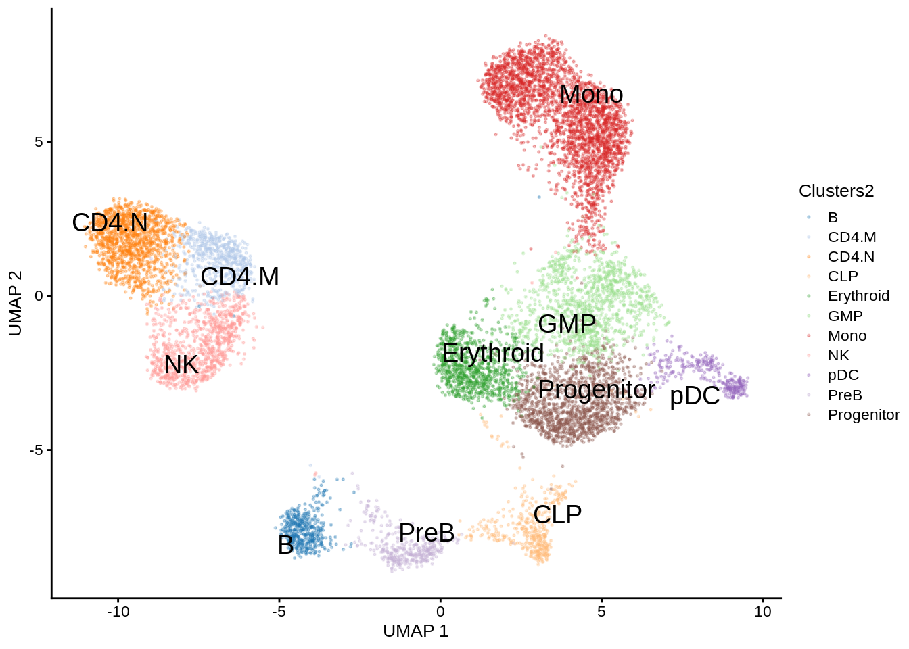
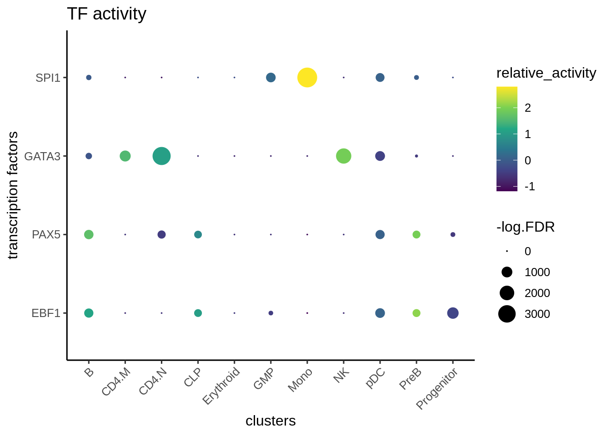
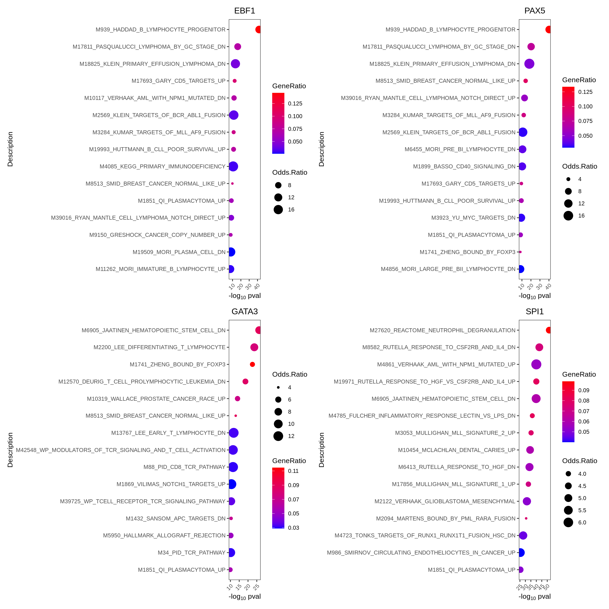
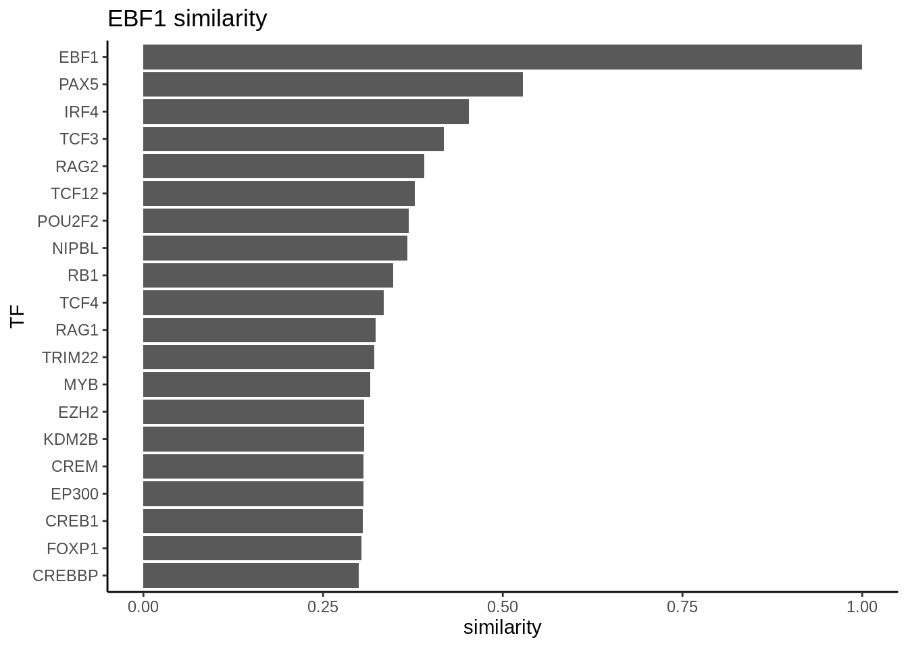
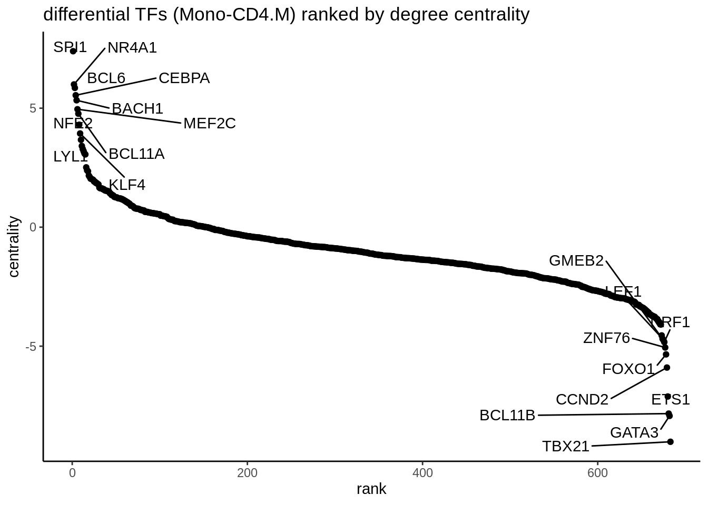
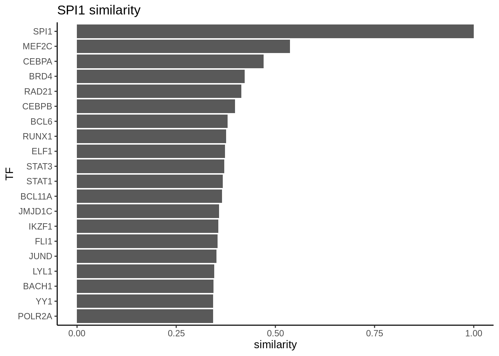

# Advanced workflow with MultiAssayExperiment

In this chapter, we illustrate the epiregulon workflow starting from data in the form of `SingleCellExperiment` objects using the Wilcoxon weight estimation method.

This is a dataset of hematopoiesis from the ArchR [tutorial](https://www.archrproject.com/bookdown/index.html). Prior to using epiregulon, this dataset has been fully preprocessed in ArchR, and converted to a `MultiAssayExperiment` using `epireglon.archr::archr2MAE`. The MAE object was uploaded to `scMultiome` for full reproducibility. In this dataset, scRNAseq and scATACseq were unpaired and integrated by the `ArchR::addGeneIntegrationMatrix` function. 

## Data preparation

Download the example dataset from *[scMultiome](https://bioconductor.org/packages/3.20/scMultiome)* package


``` r
mae <- scMultiome::hematopoiesis()

# Load peak matrix
PeakMatrix <- mae[["PeakMatrix"]]

# Load expression matrix
GeneExpressionMatrix <- mae[["GeneIntegrationMatrix"]]

# Add gene symbols to rownames
rownames(GeneExpressionMatrix) <- rowData(GeneExpressionMatrix)$name

# Transfer dimensionality reduction matrix to GeneExpression
reducedDim(GeneExpressionMatrix, "IterativeLSI") <- 
  reducedDim(mae[['TileMatrix500']], "IterativeLSI")
reducedDim(GeneExpressionMatrix, "UMAP") <- 
  reducedDim(mae[['TileMatrix500']], "UMAP")
```

Visualize the data

``` r
scater::plotReducedDim(GeneExpressionMatrix, 
                       dimred = "UMAP", 
                       text_by = "Clusters2", 
                       colour_by = "Clusters2",
                       point_size = 0.3,
                       point_alpha = 0.3)
```



## Retrieve bulk TF ChIP-seq binding sites 

First, we retrieve the information of TF binding sites collected from Cistrome and ENCODE ChIP-seq. Currently, human genomes hg19 and hg38 and mouse genome mm10 are available

``` r
library(epiregulon)
grl <- getTFMotifInfo(genome = "hg19")
```

```
## see ?scMultiome and browseVignettes('scMultiome') for documentation
```

```
## loading from cache
```

``` r
grl
```

```
## GRangesList object of length 1558:
## $AEBP2
## GRanges object with 2761 ranges and 0 metadata columns:
##          seqnames            ranges strand
##             <Rle>         <IRanges>  <Rle>
##      [1]     chr1       10001-10446      *
##      [2]     chr1     877485-877780      *
##      [3]     chr1     919866-920161      *
##      [4]     chr1   2985496-2985846      *
##      [5]     chr1   2985975-2986514      *
##      ...      ...               ...    ...
##   [2757]     chrY   8333302-8333771      *
##   [2758]     chrY 13842450-13842966      *
##   [2759]     chrY 13868154-13868670      *
##   [2760]     chrY 21464547-21465020      *
##   [2761]     chrY 22147548-22147868      *
##   -------
##   seqinfo: 25 sequences from an unspecified genome; no seqlengths
## 
## ...
## <1557 more elements>
```

## Link ATACseq peaks to target genes

Next, we compute peak to gene correlations using a custom algorithm that has similar performance to ArchR's P2G function. Wherever possible, use a multidimensional dimensionality reduction matrix such as LSI or PCA instead of UMAP or TSNE since the former provides a more accurate estimate of cell similarity.


``` r
set.seed(1010)
p2g <- calculateP2G(peakMatrix = PeakMatrix, 
                    expMatrix = GeneExpressionMatrix, 
                    exp_assay = "normalizedCounts",
                    reducedDim = reducedDim(GeneExpressionMatrix, "IterativeLSI"))
```

```
## Using epiregulon to compute peak to gene links...
```

```
## performing k means clustering to form metacells
```

```
## Computing correlation
```

``` r
p2g
```

```
## DataFrame with 12952 rows and 8 columns
##         idxATAC         chr     start       end    idxRNA    target Correlation
##       <integer> <character> <integer> <integer> <integer>   <array>    <matrix>
## 1             7        chr1    801002    801502         2 LINC00115    0.672342
## 2             8        chr1    805039    805539         6    KLHL17    0.570329
## 3            24        chr1    894453    894953         6    KLHL17    0.605406
## 4            37        chr1    935289    935789         8      HES4    0.553607
## 5            42        chr1    948574    949074         6    KLHL17    0.563872
## ...         ...         ...       ...       ...       ...       ...         ...
## 12948    146390       chr22  50980758  50981258     12082     ODF3B    0.818101
## 12949    146390       chr22  50980758  50981258     12088  MAPK8IP2    0.606537
## 12950    146403       chr22  51021154  51021654     12078      LMF2    0.505536
## 12951    146403       chr22  51021154  51021654     12089      ARSA    0.587286
## 12952    146412       chr22  51110826  51111326     12090    SHANK3    0.589347
##        distance
##       <integer>
## 1         38099
## 2         90427
## 3          1013
## 4             0
## 5         52606
## ...         ...
## 12948      9749
## 12949     57872
## 12950     75018
## 12951     44946
## 12952      1743
```

## Add TF motif binding to peaks

The next step is to add the TF motif binding information by overlapping the regions of the peak matrix with the bulk chip-seq database.

``` r
overlap <- addTFMotifInfo(grl = grl, p2g = p2g, peakMatrix = PeakMatrix)
```

```
## Computing overlap...
```

```
## Success!
```

``` r
head(overlap)
```

```
##      idxATAC idxTF      tf
## 1013       7    13    ARNT
## 1014       7    17    ATF2
## 1015       7    21    ATF7
## 1016       7    28    BCL6
## 1017       7    30    BCOR
## 1018       7    32 BHLHE40
```

## Generate regulons

A long format dataframe, representing the inferred regulons, is then generated. The dataframe consists of three columns:

* tf (transcription factor)
* target gene
* peak to gene correlation between tf and target gene


``` r
regulon <- getRegulon(p2g, overlap, aggregate=FALSE)
regulon
```

```
## DataFrame with 2040269 rows and 10 columns
##           idxATAC         chr     start       end    idxRNA      target
##         <integer> <character> <integer> <integer> <integer> <character>
## 1               7        chr1    801002    801502         2   LINC00115
## 2               7        chr1    801002    801502         2   LINC00115
## 3               7        chr1    801002    801502         2   LINC00115
## 4               7        chr1    801002    801502         2   LINC00115
## 5               7        chr1    801002    801502         2   LINC00115
## ...           ...         ...       ...       ...       ...         ...
## 2040265    146412       chr22  51110826  51111326     12090      SHANK3
## 2040266    146412       chr22  51110826  51111326     12090      SHANK3
## 2040267    146412       chr22  51110826  51111326     12090      SHANK3
## 2040268    146412       chr22  51110826  51111326     12090      SHANK3
## 2040269    146412       chr22  51110826  51111326     12090      SHANK3
##          distance     idxTF              tf     corr
##         <integer> <integer>     <character> <matrix>
## 1           38099        13            ARNT 0.672342
## 2           38099        17            ATF2 0.672342
## 3           38099        21            ATF7 0.672342
## 4           38099        28            BCL6 0.672342
## 5           38099        30            BCOR 0.672342
## ...           ...       ...             ...      ...
## 2040265      1743      1172 POLR2AphosphoS5 0.589347
## 2040266      1743      1312           ZNF16 0.589347
## 2040267      1743      1461          ZNF600 0.589347
## 2040268      1743      1490          ZNF687 0.589347
## 2040269      1743      1520          ZNF777 0.589347
```

## Prune network

Epiregulon prunes the network by performing tests of independence on the observed number of cells jointly expressing transcription factor (TF), regulatory element (RE) and target gene (TG) vs the expected number of cells if TF/RE and TG are independently expressed. We implement two tests, the binomial test and the chi-square test. In the binomial test, the expected probability is P(TF, RE) * P(TG), and the number of trials is the total number of cells, and the observed successes is the number of cells jointly expressing all three elements. In the chi-square test, the expected probability for having all 3 elements active is also P(TF, RE) * P(TG) and the probability otherwise is 1- P(TF, RE) * P(TG). The observed cell count for the active category is the number of cells jointly expressing all three elements, and the cell count for the inactive category is n - n_triple.


We calculate cluster-specific p-values if users supply cluster labels. This is useful if we are interested in cluster-specific networks. The pruned regulons can then be used to visualize differential networks for transcription factors of interest. See section on differential networks.


``` r
pruned.regulon <- pruneRegulon(expMatrix = GeneExpressionMatrix,
                               exp_assay = "normalizedCounts",
                               peakMatrix = PeakMatrix,
                               peak_assay = "counts",
                               regulon = regulon,
                               prune_value = "pval",
                               regulon_cutoff = 0.05,
                               clusters = GeneExpressionMatrix$Clusters2)
```

```
## pruning network with chi.sq tests using a regulon cutoff of pval<0.05
```

```
## pruning regulons
```

## Add Weights

While the `pruneRegulon` function provides statistics on the joint occurrence of TF-RE-TG, we would like to further estimate the strength of regulation. Biologically, this can be interpreted as the magnitude of gene expression changes induced by transcription factor activity. Epiregulon estimates the regulatory potential using one of the three measures: 1) correlation between TG and TF or between TG and the product of TF and RE, 2) mutual information between TG and TF expression or between TG and the product of TF and RE, or 3) Wilcoxon test statistics of target gene expression in cells jointly expressing all 3 elements vs cells that do not.

Two measures (correlation and Wilcoxon) give both the magnitude and directionality of changes whereas mutational information is always positive. The correlation and mutual information statistics are computed on grouped pseudobulks by user-supplied cluster labels and yield a single weight across all clusters per each TF-RE-target triplet. In contrast, the Wilcoxon method group cells based on the joint expression of TF, RE and TG in each single cell or in cell aggregates. If cell labels are provided, we calculate cluster-specific weights in addition to estimating weights from all the cells. Cell aggregation uses a default value of 10 cells and can help overcome sparsity and speed up computation. If cluster labels are provided, we can obtain weights of individual clusters and all cells combined. 

In this example, we apply Wilcoxon test on cell aggregates of 10 cells. We use the Wilcoxon weight method because we are interested in computing cell type-specific weights.
 

``` r
set.seed(1010)
regulon.w <- addWeights(regulon = pruned.regulon,
                        expMatrix  = GeneExpressionMatrix,
                        exp_assay  = "normalizedCounts",
                        peakMatrix = PeakMatrix,
                        peak_assay = "counts",
                        clusters = GeneExpressionMatrix$Clusters2,
                        aggregateCells = TRUE,
                        method = "wilcox",
                        useDim = "IterativeLSI")
```

```
## adding weights using wilcoxon...
```

```
## performing pseudobulk using an average of 10 cells
```

``` r
regulon.w
```

```
## DataFrame with 417041 rows and 14 columns
##          idxATAC         chr     start       end    idxRNA      target
##        <integer> <character> <integer> <integer> <integer> <character>
## 1            732        chr1   8021367   8021867        95        UTS2
## 2            891        chr1   9223922   9224422       107        H6PD
## 3           1154        chr1  11724524  11725024       135       FBXO6
## 4           1476        chr1  16003338  16003838       181        DDI2
## 5           2329        chr1  25237599  25238099       295       RUNX3
## ...          ...         ...       ...       ...       ...         ...
## 417037    134071       chr19  41768840  41769340      9199       TGFB1
## 417038    135998       chr19  54711800  54712300      9580      MBOAT7
## 417039    144131       chr22  30838237  30838737     11838       SF3A1
## 417040    144587       chr22  37297198  37297698     11901      CSF2RB
## 417041    144587       chr22  37297198  37297698     11904        MPST
##         distance     idxTF          tf     corr                         pval
##        <integer> <integer> <character> <matrix>                     <matrix>
## 1          48072      1030        ADNP 0.534911 1.11552e-06:1:0.00021207:...
## 2          70440      1030        ADNP 0.580146 2.42572e-53:1:1.00000000:...
## 3            373      1030        ADNP 0.504093 1.70871e-07:1:0.96772981:...
## 4          59384      1030        ADNP 0.701968 2.50344e-04:1:1.00000000:...
## 5          53512      1030        ADNP 0.859918 7.39278e-14:1:1.00000000:...
## ...          ...       ...         ...      ...                          ...
## 417037     90490       473     ZSCAN29 0.621256          7.23903e-01:1:1:...
## 417038     18066       473     ZSCAN29 0.797633          4.26510e-02:1:1:...
## 417039     85323       473     ZSCAN29 0.541202          2.76179e-05:1:1:...
## 417040     11976       473     ZSCAN29 0.676467          1.12773e-03:1:1:...
## 417041    117984       473     ZSCAN29 0.551815          1.81933e-02:1:1:...
##                             stats                qval
##                          <matrix>            <matrix>
## 1       23.7177:0:13.72100224:... 1.00000e+00:1:1:...
## 2      236.3764:0: 0.00000000:... 4.49763e-47:1:1:...
## 3       27.3374:0: 0.00163667:... 2.89349e-01:1:1:...
## 4       13.4096:0: 0.00000000:... 1.00000e+00:1:1:...
## 5       55.9609:0: 0.00000000:... 1.29743e-07:1:1:...
## ...                           ...                 ...
## 417037           0.124784:0:0:...           1:1:1:...
## 417038           4.109182:0:0:...           1:1:1:...
## 417039          17.575117:0:0:...           1:1:1:...
## 417040          10.605155:0:0:...           1:1:1:...
## 417041           5.577442:0:0:...           1:1:1:...
##                                  weight
##                                <matrix>
## 1      0.110121:-0.1840694:0.132197:...
## 2      0.328729: 0.0954775:0.218160:...
## 3      0.142351: 0.1861417:0.180140:...
## 4      0.175202: 0.0000000:0.000000:...
## 5      0.455341: 0.0000000:0.302052:...
## ...                                 ...
## 417037         0.124462: 0.182873:0:...
## 417038         0.226807:-0.109380:0:...
## 417039         0.256050:-0.198350:0:...
## 417040         0.250945: 0.000000:0:...
## 417041         0.275493: 0.000000:0:...
```

## Calculate TF activity 

Finally, the activities for a specific TF in each cell are computed by averaging the weighted expressions of target genes linked to the TF weighted. 
$$y=\frac{1}{n}\sum_{i=1}^{n} x_i * weight_i$$
where $y$ is the activity of a TF for a cell
$n$ is the total number of targets for a TF
$x_i$ is the log count expression of target i where i in {1,2,...,n}
$weight_i$ is the weight of TF and target i


``` r
score.combine <- calculateActivity(expMatrix = GeneExpressionMatrix, 
                                   regulon = regulon.w, 
                                   mode = "weight", 
                                   method = "weightedMean", 
                                   exp_assay = "normalizedCounts")
```

```
## calculating TF activity from regulon using weightedmean
```

```
## Warning in calculateActivity(expMatrix = GeneExpressionMatrix, regulon =
## regulon.w, : The weight column contains multiple subcolumns but no cluster
## information was provided. Using first column to compute activity...
```

```
## aggregating regulons...
```

```
## creating weight matrix...
```

```
## calculating activity scores...
```

```
## normalize by the number of targets...
```

``` r
head(score.combine[1:5,1:5])
```

```
## 5 x 5 sparse Matrix of class "dgCMatrix"
##      scATAC_BMMC_R1#TTATGTCAGTGATTAG-1 scATAC_BMMC_R1#AAGATAGTCACCGCGA-1
## ADNP                        0.15753057                         0.2101894
## AFF1                        0.19542798                         0.1939089
## AFF4                        0.11994675                         0.3389850
## AGO1                        0.18243109                         0.2156398
## AGO2                        0.08236242                         0.3744209
##      scATAC_BMMC_R1#GCATTGAAGATTCCGT-1 scATAC_BMMC_R1#TATGTTCAGGGTTCCC-1
## ADNP                         0.1741788                         0.1582809
## AFF1                         0.5338244                         0.1934617
## AFF4                         0.1341601                         0.1989533
## AGO1                         0.1189042                         0.1736376
## AGO2                         0.1113447                         0.2071216
##      scATAC_BMMC_R1#AGTTACGAGAACGTCG-1
## ADNP                        0.18664284
## AFF1                        0.20511278
## AFF4                        0.13569139
## AGO1                        0.21700829
## AGO2                        0.07640601
```

## Differential TF activity test

We can next determine which TFs exhibit differential activities across cell clusters/groups via the `findDifferentialActivity` function. This function depends on `findMarkers` function from *[scran](https://bioconductor.org/packages/3.20/scran)* package. 


``` r
library(epiregulon.extra)
markers  <- findDifferentialActivity(activity_matrix = score.combine, 
                                    clusters = GeneExpressionMatrix$Clusters2, 
                                    pval.type = "some", 
                                    direction = "up", 
                                    test.type = "t")
```

getSigGenes compiles the different test results into a single dataframe and enables user to supply their desired cutoffs for significance and variable to order by.


``` r
markers.sig <- getSigGenes(markers, topgenes = 3 )
```

```
## Using a logFC cutoff of 0.2 for class B for direction equal to any
```

```
## Using a logFC cutoff of 0.4 for class CD4.M for direction equal to any
```

```
## Using a logFC cutoff of 0.4 for class CD4.N for direction equal to any
```

```
## Using a logFC cutoff of 0.2 for class CLP for direction equal to any
```

```
## Using a logFC cutoff of 0.3 for class Erythroid for direction equal to any
```

```
## Using a logFC cutoff of 0.2 for class GMP for direction equal to any
```

```
## Using a logFC cutoff of 0.8 for class Mono for direction equal to any
```

```
## Using a logFC cutoff of 0.4 for class NK for direction equal to any
```

```
## Using a logFC cutoff of 0.1 for class pDC for direction equal to any
```

```
## Using a logFC cutoff of 0.3 for class PreB for direction equal to any
```

```
## Using a logFC cutoff of 0.2 for class Progenitor for direction equal to any
```

## Visualizing TF activities

Epiregulon also provides multiple options for visualizing the inferred TF activities by reduced dimensional space

tSNE or UMAP plots:

``` r
options(ggrastr.default.dpi=300)
tfs_interest <- c("EBF1","PAX5", "GATA3","SPI1")
plotActivityDim(sce = GeneExpressionMatrix,
                activity_matrix = score.combine[tfs_interest,], 
                tf = tfs_interest, 
                dimtype = "UMAP",
                nrow=2,
                ncol=2,
                point_size=0.1,
                rasterise = TRUE)
```


We can compare the activity with gene expression of the same TFs.


``` r
plotActivityDim(sce = GeneExpressionMatrix, 
                activity_matrix = assay(GeneExpressionMatrix, "normalizedCounts")[tfs_interest,], 
                tf = tfs_interest, 
                dimtype = "UMAP",
                nrow=2,
                ncol=2,
                legend.label = "Gex",
                colors = c("grey","blue"),
                point_size=0.1,
                rasterise = TRUE)
```


We can also plot violin plot to visualize TF activity.

``` r
plotActivityViolin(activity_matrix = score.combine, 
                   tf = tfs_interest, 
                   clusters = GeneExpressionMatrix$Clusters2,
                   legend.label = "Gex",
                   nrow=2,
                   ncol=2)
```


We plot violin plot to visualize TF gene expression.


``` r
plotActivityViolin(activity_matrix = assay(GeneExpressionMatrix, "normalizedCounts")[tfs_interest,],  
                   tf = tfs_interest, 
                   clusters = GeneExpressionMatrix$Clusters2,
                   nrow=2,
                   ncol=2,
                   legend.label = "gene expression")
```


We can visualize the different TFs in a bubble plot:

``` r
plotBubble(activity_matrix = score.combine, 
           tf = tfs_interest, 
           GeneExpressionMatrix$Clusters2, 
           bubblesize = "FDR")
```



We visualize the top differential TFs based on activity.


``` r
plotBubble(activity_matrix = score.combine, 
           tf = markers.sig$tf, 
           GeneExpressionMatrix$Clusters2, 
           bubblesize = "FDR")
```


## Geneset enrichment

Sometimes we are interested to know what pathways are enriched in the regulon of a particular TF. We can perform geneset enrichment using the enricher function from [clusterProfiler](http://yulab-smu.top/biomedical-knowledge-mining-book/universal-api.html).

Here we first download Hallmark and C2 signatures from hallmark and then perform gene set enrichment of the known lineage factors. As expected, EBF1 is consistent with a B cell lineage factor, GATA3 and RUNX3 with lymphoid lineage and SPI1 with myeloid lineage.


``` r
#retrieve genesets
H <- EnrichmentBrowser::getGenesets(org = "hsa", 
                                    db = "msigdb", 
                                    cat = "H", 
                                    gene.id.type = "SYMBOL" )
C2 <- EnrichmentBrowser::getGenesets(org = "hsa", 
                                     db = "msigdb", 
                                     cat = "C2",
                                     gene.id.type = "SYMBOL" )


#combine genesets and convert genesets to be compatible with enricher
gs <- c(H, C2)
gs.list <- do.call(rbind,lapply(names(gs), function(x) 
  {data.frame(gs=x, genes=gs[[x]])}))

enrichresults <- regulonEnrich(TF = tfs_interest, 
                               regulon = regulon.w, 
                               weight = "weight",
                               weight_cutoff = 0, 
                               genesets = gs.list)
```

```
## EBF1
```

```
## 
```

```
## PAX5
```

```
## GATA3
```

```
## SPI1
```

``` r
#plot results
enrichPlot(results = enrichresults, ncol=2)
```



## Differential Network analysis

In addition to looking at the summed TF activity, a second approach to investigate differential TF activity is to compare and contrast target genes or network topology. In this example, we know that EBF1 is a B cell lineage factor. If we plot the differential network of EBF1 using the regulon with cluster-specific weights, we can see that EBF1 has many more targets in PreB cells than it has in CD4 memory T cells. 


``` r
plotDiffNetwork(regulon.w,
                cutoff = 0,
                tf = c("EBF1"),
                weight = "weight",
                clusters = c("PreB","CD4.M"),
                layout = "stress")
```

```
## Replacement of na values for weights with 0
```

```
## Building graph using weight as edge weights
```


Sometimes, we are interested to identify interaction partners of the TFs of interest. This can be achieved by comparing the overlap of the targets genes for all the TFs and identify the most similar TFs by Jaccard similarity. To illustrate this function, we take a look at the top most similar 20 TFs to EBF1, and we successfully identify PAX5 as the most similar TF. Both PAX5 and EBF1 are important factors for B cell development (https://www.nature.com/articles/ni.2641).


``` r
library(ggplot2)
# construct a graph of the preB cells
preB_network <- buildGraph(regulon.w, weights = "weight", cluster="PreB")
```

```
## Building graph using weight as edge weights
```

``` r
# compute a similarity matrix of all TFs
similarity_score <- calculateJaccardSimilarity(preB_network)

# Focus on EBF1
similarity_score_EBF1 <- similarity_score[, "EBF1"]
similarity_df <- data.frame(similarity = head(sort(similarity_score_EBF1, 
                                                   decreasing = TRUE),20),
                            TF = names(head(sort(similarity_score_EBF1,
                                                 decreasing = TRUE),20)))

similarity_df$TF <- factor(similarity_df$TF, levels = rev(unique(similarity_df$TF)))

# plot top TFs most similar to EBF1
topTFplot <- ggplot(similarity_df, aes(x=TF, y=similarity)) +
  geom_bar(stat="identity") +
  coord_flip() +
  ggtitle("EBF1 similarity") +
  theme_classic()

print(topTFplot)
```



In order to convince ourselves that our differential network is statistically significant, we permute the edges and obtain a background graph from averaging many iterations. Here, we plot the differential network graph subtracted by permuted graphs. 

``` r
# create a permuted graph by rewiring the edges 100 times
permute_matrix <- permuteGraph(preB_network, "EBF1", 100, p=1)
permute_matrix <- permute_matrix[names(similarity_score_EBF1),]
diff_matrix <- similarity_score_EBF1-rowMeans(permute_matrix)

diff_matrix_df <- data.frame(similarity = head(sort(diff_matrix, 
                                                    decreasing = TRUE),20),
                            TF = names(head(sort(diff_matrix,
                                                 decreasing = TRUE),20)))

diff_matrix_df$TF <- factor(diff_matrix_df$TF, levels = rev(unique(diff_matrix_df$TF)))

# plot top TFs most similar to EBF1
topTFplot <- ggplot(diff_matrix_df, aes(x=TF, y=similarity)) +
            geom_bar(stat="identity") +
            coord_flip() +
            ggtitle("background subtracted EBF1 similarity ") +
            theme_classic()
print(topTFplot)
```


``` r
# obtain empirical p-values
p_matrix <- rowMeans(apply(permute_matrix, 2, function(x) {x > similarity_score_EBF1}))
p_matrix[names(head(sort(diff_matrix,decreasing = TRUE),20))]
```

```
##   PAX5   IRF4   TCF3   RAG2  TCF12 POU2F2  NIPBL    RB1   TCF4   RAG1 TRIM22 
##      0      0      0      0      0      0      0      0      0      0      0 
##    MYB  CREB1   EZH2  KDM2B  FOXP1   CREM  EP300 CREBBP  FOXO1 
##      0      0      0      0      0      0      0      0      0
```

Next, we are interested to compare the networks of two cell types, in this case, CD4 memory T cells (CD4.M) vs Monocytes (mono) cells. We build an edge subtracted graph and then calculate the degree centrality of the subtracted graph. We normalize centrality using the default square root function. The top 5 most positive TFs represent lineage factors more active in NK cells whereas the bottom 5 TFs present lineage factors enriched in CD4. We successfully identified the myeloid factor SPI1 to be associated with monocytes and Th1 factor TBX21 to be associated with CD4 T cells.


``` r
#regulon.w.2 <- regulon.w
#regulon.w <- readRDS("/gstore/project/lineage/manuscript/epiregulon/OUTPUT/regulon.w.rds")
# construct a graph of the CD4.M and NK cells respectively
CD4.M_network <- buildGraph(regulon.w, weights = "weight", cluster="CD4.M")
```

```
## Building graph using weight as edge weights
```

``` r
Mono_network <- buildGraph(regulon.w, weights = "weight", cluster="Mono")
```

```
## Building graph using weight as edge weights
```

``` r
# construct a difference graph
diff_graph <- buildDiffGraph(Mono_network,CD4.M_network, abs_diff = FALSE)
diff_graph <- addCentrality(diff_graph)
diff_graph <- normalizeCentrality(diff_graph)
rank_table <- rankTfs(diff_graph)

library(ggplot2)
ggplot(rank_table, aes(x = rank, y = centrality)) +
    geom_point() +
    ggrepel::geom_text_repel(data = rbind(head(rank_table, 10), 
                                          tail(rank_table, 10)), 
                             aes(label = tf), 
                             nudge_x = 0, nudge_y = 0, box.padding = 0.5, max.overlaps = Inf) +
    theme_classic() + ggtitle ("differential TFs (Mono-CD4.M) ranked by degree centrality")
```



We can further explore interacting factors with the myeloid factor SPI1 using the same Jaccard similarity approach. We found CEBPA as the most similar TF as SPI1. SPI1 and CEBPA are known to be important for differentiation into myeloid cells (https://www.cell.com/cell-reports/pdfExtended/S2211-1247(18)30745-9).

``` r
library(igraph)
```

``` r
diff_graph_filter <- subgraph.edges(diff_graph, 
                                    E(diff_graph)[E(diff_graph)$weight>0], 
                                    del=TRUE)


# compute a similarity matrix of all TFs
similarity_score <- calculateJaccardSimilarity(diff_graph_filter)

# Focus on SPI1
similarity_score_SPI1 <- similarity_score[, "SPI1"]
similarity_df <- data.frame(similarity = head(sort(similarity_score_SPI1, 
                                                   decreasing = TRUE),20),
                            TF = names(head(sort(similarity_score_SPI1,
                                                 decreasing = TRUE),20)))

similarity_df$TF <- factor(similarity_df$TF, 
                           levels = rev(unique(similarity_df$TF)))

# plot top TFs most similar to SPI1
topTFplot <- ggplot(similarity_df, aes(x=TF, y=similarity)) +
  geom_bar(stat="identity") +
  coord_flip() +
  ggtitle("SPI1 similarity") +
  theme_classic()

print(topTFplot)
```



## Session Info


``` r
sessionInfo()
```

```
## R version 4.4.0 (2024-04-24)
## Platform: x86_64-pc-linux-gnu
## Running under: Red Hat Enterprise Linux 8.6 (Ootpa)
## 
## Matrix products: default
## BLAS/LAPACK: /apps/rocs/2020.08/cascadelake/software/OpenBLAS/0.3.9-GCC-9.3.0/lib/libopenblas_skylakexp-r0.3.9.so;  LAPACK version 3.9.0
## 
## locale:
##  [1] LC_CTYPE=en_US.UTF-8       LC_NUMERIC=C              
##  [3] LC_TIME=en_US.UTF-8        LC_COLLATE=en_US.UTF-8    
##  [5] LC_MONETARY=en_US.UTF-8    LC_MESSAGES=en_US.UTF-8   
##  [7] LC_PAPER=en_US.UTF-8       LC_NAME=C                 
##  [9] LC_ADDRESS=C               LC_TELEPHONE=C            
## [11] LC_MEASUREMENT=en_US.UTF-8 LC_IDENTIFICATION=C       
## 
## time zone: America/Los_Angeles
## tzcode source: system (glibc)
## 
## attached base packages:
## [1] stats4    stats     graphics  grDevices utils     datasets  methods  
## [8] base     
## 
## other attached packages:
##  [1] igraph_2.0.3                ggplot2_3.5.1              
##  [3] org.Hs.eg.db_3.20.0         AnnotationDbi_1.67.0       
##  [5] msigdbr_7.5.1               epiregulon.extra_1.1.4     
##  [7] epiregulon_1.3.4            scMultiome_1.5.7           
##  [9] SingleCellExperiment_1.27.2 MultiAssayExperiment_1.31.5
## [11] SummarizedExperiment_1.35.4 Biobase_2.65.1             
## [13] GenomicRanges_1.57.2        GenomeInfoDb_1.41.2        
## [15] IRanges_2.39.2              S4Vectors_0.43.2           
## [17] MatrixGenerics_1.17.0       matrixStats_1.4.1          
## [19] ExperimentHub_2.13.1        AnnotationHub_3.13.3       
## [21] BiocFileCache_2.13.2        dbplyr_2.5.0               
## [23] BiocGenerics_0.51.3        
## 
## loaded via a namespace (and not attached):
##   [1] splines_4.4.0            later_1.3.2              ggplotify_0.1.2         
##   [4] bitops_1.0-9             filelock_1.0.3           R.oo_1.26.0             
##   [7] tibble_3.2.1             polyclip_1.10-7          graph_1.83.0            
##  [10] XML_3.99-0.17            lifecycle_1.0.4          edgeR_4.3.19            
##  [13] processx_3.8.4           lattice_0.22-6           MASS_7.3-61             
##  [16] backports_1.5.0          magrittr_2.0.3           limma_3.61.12           
##  [19] sass_0.4.9               rmarkdown_2.28           jquerylib_0.1.4         
##  [22] yaml_2.3.10              metapod_1.13.0           RColorBrewer_1.1-3      
##  [25] cowplot_1.1.3            chromote_0.3.1           DBI_1.2.3               
##  [28] abind_1.4-8              zlibbioc_1.51.1          R.utils_2.12.3          
##  [31] purrr_1.0.2              ggraph_2.2.1             RCurl_1.98-1.16         
##  [34] yulab.utils_0.1.7        tweenr_2.0.3             rappdirs_0.3.3          
##  [37] GenomeInfoDbData_1.2.13  enrichplot_1.25.3        ggrepel_0.9.6           
##  [40] irlba_2.3.5.1            tidytree_0.4.6           BiocStyle_2.33.1        
##  [43] annotate_1.83.0          dqrng_0.4.1              codetools_0.2-20        
##  [46] DelayedArray_0.31.14     DOSE_3.99.1              scuttle_1.15.4          
##  [49] ggforce_0.4.2            tidyselect_1.2.1         aplot_0.2.3             
##  [52] UCSC.utils_1.1.0         farver_2.1.2             ScaledMatrix_1.13.0     
##  [55] viridis_0.6.5            jsonlite_1.8.9           BiocNeighbors_1.99.2    
##  [58] tidygraph_1.3.1          scater_1.33.4            tools_4.4.0             
##  [61] treeio_1.29.1            Rcpp_1.0.13              glue_1.8.0              
##  [64] gridExtra_2.3            SparseArray_1.5.44       xfun_0.48               
##  [67] qvalue_2.37.0            websocket_1.4.2          dplyr_1.1.4             
##  [70] HDF5Array_1.33.8         withr_3.0.1              BiocManager_1.30.25     
##  [73] fastmap_1.2.0            rhdf5filters_1.17.0      bluster_1.15.1          
##  [76] fansi_1.0.6              digest_0.6.37            rsvd_1.0.5              
##  [79] gridGraphics_0.5-1       R6_2.5.1                 mime_0.12               
##  [82] colorspace_2.1-1         GO.db_3.20.0             Cairo_1.6-2             
##  [85] RSQLite_2.3.7            R.methodsS3_1.8.2        utf8_1.2.4              
##  [88] tidyr_1.3.1              generics_0.1.3           data.table_1.16.2       
##  [91] graphlayouts_1.2.0       httr_1.4.7               S4Arrays_1.5.10         
##  [94] scatterpie_0.2.4         pkgconfig_2.0.3          gtable_0.3.5            
##  [97] blob_1.2.4               XVector_0.45.0           shadowtext_0.1.4        
## [100] clusterProfiler_4.13.4   htmltools_0.5.8.1        fgsea_1.31.6            
## [103] bookdown_0.40            GSEABase_1.67.0          scales_1.3.0            
## [106] png_0.1-8                ggfun_0.1.7              scran_1.33.2            
## [109] knitr_1.48               rstudioapi_0.16.0        reshape2_1.4.4          
## [112] nlme_3.1-166             checkmate_2.3.2          curl_5.2.3              
## [115] cachem_1.1.0             rhdf5_2.49.0             stringr_1.5.1           
## [118] BiocVersion_3.20.0       parallel_4.4.0           vipor_0.4.7             
## [121] ggrastr_1.0.2            pillar_1.9.0             grid_4.4.0              
## [124] vctrs_0.6.5              promises_1.3.0           BiocSingular_1.21.4     
## [127] beachmat_2.21.6          xtable_1.8-4             cluster_2.1.6           
## [130] beeswarm_0.4.0           Rgraphviz_2.49.1         evaluate_1.0.1          
## [133] KEGGgraph_1.65.0         cli_3.6.3                locfit_1.5-9.10         
## [136] compiler_4.4.0           rlang_1.1.4              crayon_1.5.3            
## [139] labeling_0.4.3           ps_1.8.0                 fs_1.6.4                
## [142] plyr_1.8.9               ggbeeswarm_0.7.2         stringi_1.8.4           
## [145] viridisLite_0.4.2        BiocParallel_1.39.0      babelgene_22.9          
## [148] munsell_0.5.1            Biostrings_2.73.2        lazyeval_0.2.2          
## [151] GOSemSim_2.31.2          Matrix_1.7-0             patchwork_1.3.0         
## [154] bit64_4.5.2              Rhdf5lib_1.27.0          KEGGREST_1.45.1         
## [157] statmod_1.5.0            highr_0.11               beachmat.hdf5_1.3.3     
## [160] memoise_2.0.1            bslib_0.8.0              ggtree_3.13.1           
## [163] fastmatch_1.1-4          bit_4.5.0                EnrichmentBrowser_2.35.1
## [166] gson_0.1.0               ape_5.8
```

