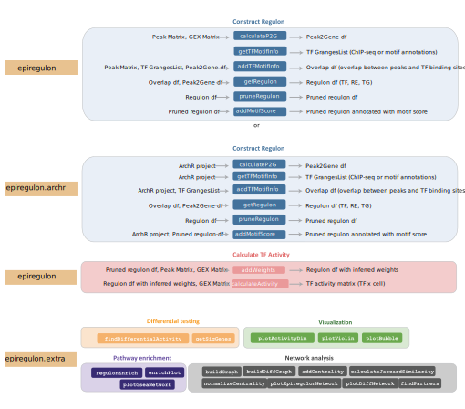

--- 
title: "Epiregulon documentation"
author: "Xiaosai Yao, Tomasz Włodarczyk"
date: "2025-01-15"
site: bookdown::bookdown_site
documentclass: book
bibliography:
- book.bib
- packages.bib
description: "This book presents the Epiregulon package. We provide the tutorials
  showing different\nscenarions in which the package can be usd to analyse single-cell
  data. \n"
link-citations: yes
github-repo: "rstudio/bookdown-demo"
---

# Introduction {-}

Gene regulatory networks model the underlying gene regulation hierarchies that drive gene expression and cell states. The main function of the epiregulon package is to construct gene regulatory networks and infer transcription factor (TF) activity in single cells by integration of scATAC-seq and scRNA-seq data and incorporation of public bulk TF ChIP-seq data.

Epiregulon assigns regulatory elements (REs) to their putative target genes (TGs) if the chromatin accessibility and gene expressions are highly correlated across cell clusters. Each regulatory element is then interrogated for TF occupancy based on a compilation of public TF ChIP-seq binding sites from [ChIP-Atlas](https://chip-atlas.org/) and [ENCODE](https://www.encodeproject.org/) TF ChIP-seq data. This maps out the preliminary TF-RE-TG regulatory relationships.

Further pruning of the gene regulatory network is necessary to remove spurious gene regulatory relationships not supported by the data, especially because the public ChIP-seq data was most certainly obtained in different cell lines or treatment conditions. In this case, we want to identify the most likely TF-RE-TG triplets. Here we apply tests of independence (binomial or chi-square tests) which identify TF-RE-TG triplets jointly occurring at probabilities deviating from the expected probabilities if these three events occur independently. In other words, we assume that a TF-RE-TG regulatory relationship holds true if expression of the TG, chromatin accessibility at RE and expression of the TG tend to co-exist in the same cells. While we recognize that there could be time delays between chromatin accessibility and the expression of target genes in true RE-TG relationships, we want to be conservative in our inference and rule out unsubstantiated TF-RE-TG relationships.

After network pruning, we would like to further estimate the strength of regulation. This can be achieved using one of the three methods: 1) correlation between TG and TF or between TG and the product of TF and RE, 2) mutual information between TG and TF expression or between TG and the product of TF and RE, and 3) effect size of the Wilcoxon test between target gene expression in cells jointly expressing all 3 elements vs cells that do not. The activity of transcription factor is the weighted sum of all its target genes in which the weights correspond to the strength of regulation.
 
The target genes of TFs can be queried against known pathways to predict the functions of TFs. We can also perform differential TF activity using two approaches: 1) differential total activity or 2) differential network topology. The first approach compares differences in the sum of the target genes. The second approach involves edge subtraction between two networks and the TFs are ranked by the degree centrality of the differential graphs. Epiregulon also allows identification of interaction partners by the degree of overlaps in the target genes between two TFs.

Current prerequisites for running epiregulon include pre-computed peak matrix,  gene expression matrix and dimensionality reduction. Epiregulon offers seamless integration with [ArchR](https://www.archrproject.com/). Alternately, users can analyze their data using their favorite analysis tools and package their matrices into `MultiAssayExperiment` (See `scMultiome` package). The scATAC-seq experiment can be either paired or unpaired with the scRNA-seq dataset as long as they were already integrated. The final output of epiregulon is a matrix of TF activities where rows are individual TFs and columns are single cell indexes.

