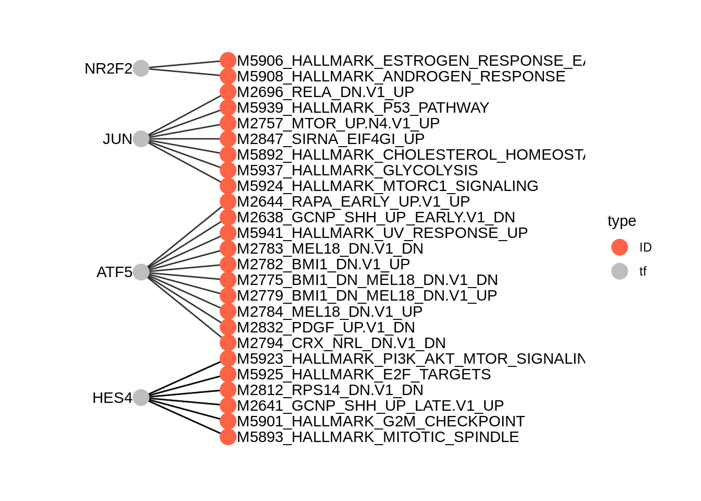

# ArchR workflow and different weight methods

In this chapter, we illustrate the epiregulon workflow starting from an ArchR project and compare the different weight estimation methods.

The dataset consists of unpaired scATACseq/scRNAseq of parental LNCaP cells treated with DMSO, Enzalutamide and Enza resistant cells. The dataset was taken from [Taavitsainen et al](https://www.nature.com/articles/s41467-021-25624-1) [GSE168667](https://www.ncbi.nlm.nih.gov/geo/query/acc.cgi?acc=GSE168667) and [GSE168668](https://www.ncbi.nlm.nih.gov/geo/query/acc.cgi?acc=GSE168668).

## Data preparation

Please refer to the full ArchR [manual](https://www.archrproject.com/bookdown/index.html) for instructions 

Before running Epiregulon, the following analyses need to be completed:

1. Obtain a peak matrix on scATACseq by using addGroupCoverages > addReproduciblePeakSet > addPeakMatrix. See chapter [10](https://www.archrproject.com/bookdown/calling-peaks-with-archr.html) from ArchR manual
2. RNA-seq integration. 
    a. For unpaired scATAC-seq, use addGeneIntegrationMatrix. See chapter [8](https://www.archrproject.com/bookdown/defining-cluster-identity-with-scrna-seq.html) from ArchR manual
    b. For multiome data, use addGeneExpressionMatrix. See [multiome](https://greenleaflab.github.io/ArchR_2020/Ex-Analyze-Multiome.html) tutorial
3. Perform dimensionality reduction from with either single modalities or joint scRNAseq and scATACseq using [addCombinedDims](https://www.archrproject.com/reference/addCombinedDims.html)

## Load ArchR project


``` r
library(ArchR)
archR_project_path <- "/gstore/project/lineage/prostate/GSE168667/OUTPUT/multiome/"
proj <- loadArchRProject(path = archR_project_path, showLogo = FALSE)
```

We verify that "GeneExpressionMatrix" and "PeakMatrix" are present for this tutorial. 


``` r
getAvailableMatrices(proj)
```

```
## [1] "GeneIntegrationMatrix" "GeneScoreMatrix"       "MotifMatrix"          
## [4] "PeakMatrix"            "TileMatrix"
```

We will use the joint reducedDims - "LSI_Combined" and  joint embeddings - "UMAP_Combined"

``` r
head(getReducedDims(proj, reducedDims = "iLSI_Combined")[,1:5])
```

```
##                                     LSI1       LSI2       LSI3        LSI4
## SRR13927735#TTATGTCTCCAGGTAT-1 -2.713935 -0.3677949 -0.4484238 -0.30645138
## SRR13927735#TATTGCTCATCAGAAA-1 -2.642781 -0.2767556 -0.9142714 -0.19675812
## SRR13927735#TTCGATTGTAGGGTTG-1 -2.322865 -0.1543080 -1.4106049 -0.08891276
## SRR13927735#CATTCATTCGGATGTT-1 -2.572976 -0.1917188 -1.0464294 -0.12660121
## SRR13927735#ACGTTAGGTCAACTGT-1 -2.478552 -0.1776639 -1.1037295 -0.22976613
## SRR13927735#AAATGCCCAGCAATGG-1 -2.595352 -0.3803464 -0.7770309 -0.52431765
##                                        LSI5
## SRR13927735#TTATGTCTCCAGGTAT-1 -0.046845365
## SRR13927735#TATTGCTCATCAGAAA-1  0.075746940
## SRR13927735#TTCGATTGTAGGGTTG-1  0.019873276
## SRR13927735#CATTCATTCGGATGTT-1  0.009947438
## SRR13927735#ACGTTAGGTCAACTGT-1 -0.150097539
## SRR13927735#AAATGCCCAGCAATGG-1 -0.243074591
```

``` r
head(getEmbedding(proj, embedding = "UMAP_Combined"))
```

```
##                                iLSI_Combined#UMAP_Dimension_1
## SRR13927735#TTATGTCTCCAGGTAT-1                      -9.622903
## SRR13927735#TATTGCTCATCAGAAA-1                      -9.360211
## SRR13927735#TTCGATTGTAGGGTTG-1                      -8.617347
## SRR13927735#CATTCATTCGGATGTT-1                      -9.285448
## SRR13927735#ACGTTAGGTCAACTGT-1                      -8.809260
## SRR13927735#AAATGCCCAGCAATGG-1                      -9.261216
##                                iLSI_Combined#UMAP_Dimension_2
## SRR13927735#TTATGTCTCCAGGTAT-1                     -0.2908237
## SRR13927735#TATTGCTCATCAGAAA-1                     -0.2892935
## SRR13927735#TTCGATTGTAGGGTTG-1                     -0.2154103
## SRR13927735#CATTCATTCGGATGTT-1                     -0.3267481
## SRR13927735#ACGTTAGGTCAACTGT-1                     -0.2168703
## SRR13927735#AAATGCCCAGCAATGG-1                      0.3200356
```
## Retrieve matrices from ArchR project

Retrieve gene expression and peak matrix from the ArchR project

``` r
GeneExpressionMatrix <- getMatrixFromProject(
    ArchRProj = proj,
    useMatrix = "GeneIntegrationMatrix",
    useSeqnames = NULL,
    verbose = TRUE,
    binarize = FALSE,
    threads = 1,
    logFile = "x"
)

PeakMatrix <- getMatrixFromProject(
    ArchRProj = proj,
    useMatrix = "PeakMatrix",
    useSeqnames = NULL,
    verbose = TRUE,
    binarize = FALSE,
    threads = 1,
    logFile = "x"
)
```
If we extract the gene expression from matrix, it will be in the form of RangedSummarizedExperiment. We can make use of `ArchRMatrix2SCE` to convert gene expression matrix to a SingleCellExperiment object. It's also important to note that gene expression from ArchR is library size normalized (not logged).

``` r
library(epiregulon.archr)
```

```
## Loading required package: SingleCellExperiment
```

```
## Loading required package: epiregulon
```

```
## 
## Attaching package: 'epiregulon.archr'
```

```
## The following objects are masked from 'package:epiregulon':
## 
##     addMotifScore, addTFMotifInfo, calculateP2G, getTFMotifInfo
```

``` r
GeneExpressionMatrix <- ArchRMatrix2SCE(GeneExpressionMatrix, rename = "normalizedCounts")
rownames(GeneExpressionMatrix) <- rowData(GeneExpressionMatrix)$name
```

We rename the assay name of the PeakMatrix as counts.


``` r
PeakMatrix <- ArchRMatrix2SCE(PeakMatrix, rename = "counts")
```

Transfer embeddings from ArchR project to singleCellExperiment for visualization


``` r
reducedDim(GeneExpressionMatrix, "UMAP_Combined") <- getEmbedding(ArchRProj = proj, 
                                                                  embedding = "UMAP_Combined", 
                                                                  returnDF = TRUE)[colnames(GeneExpressionMatrix),]


# add cell label
GeneExpressionMatrix$label <- GeneExpressionMatrix$Cells
GeneExpressionMatrix$label[GeneExpressionMatrix$Treatment == "enzalutamide 48h"] <- "LNCaP–ENZ48"
GeneExpressionMatrix$label <- factor(GeneExpressionMatrix$label, 
                                     levels = c("LNCaP", "LNCaP–ENZ48", "LNCaP RES-A", "LNCaP RES-B"))
```

Visualize singleCellExperiment by UMAP

``` r
scater::plotReducedDim(GeneExpressionMatrix, 
                       dimred = "UMAP_Combined", 
                       text_by = "label", 
                       colour_by = "label")
```


## Retrieve bulk TF ChIP-seq binding sites 

First, we retrieve the information of TF binding sites collected from Cistrome and ENCODE ChIP-seq. Currently, human genomes hg19 and hg38 and mouse mm10 are available. 


``` r
grl <- getTFMotifInfo(genome = "hg38")
```

```
## see ?scMultiome and browseVignettes('scMultiome') for documentation
```

```
## loading from cache
```

``` r
grl
```

```
## GRangesList object of length 1558:
## $AEBP2
## GRanges object with 2700 ranges and 0 metadata columns:
##          seqnames            ranges strand
##             <Rle>         <IRanges>  <Rle>
##      [1]     chr1        9792-10446      *
##      [2]     chr1     942105-942400      *
##      [3]     chr1     984486-984781      *
##      [4]     chr1   3068932-3069282      *
##      [5]     chr1   3069411-3069950      *
##      ...      ...               ...    ...
##   [2696]     chrY   8465261-8465730      *
##   [2697]     chrY 11721744-11722260      *
##   [2698]     chrY 11747448-11747964      *
##   [2699]     chrY 19302661-19303134      *
##   [2700]     chrY 19985662-19985982      *
##   -------
##   seqinfo: 25 sequences from an unspecified genome; no seqlengths
## 
## ...
## <1557 more elements>
```

## Link ATAC-seq peaks to target genes

Next, we compute peak to gene correlations using the `addPeak2GeneLinks` function from the ArchR package. The user would need 
to supply a path to an ArchR project already containing peak and gene matrices, as well as Latent semantic indexing (LSI) dimensionality reduction. 


``` r
p2g <- calculateP2G(ArchR_path = archR_project_path,
                    useDim = "iLSI_Combined", 
                    useMatrix = "GeneIntegrationMatrix",
                    threads = 1)
```

```
## Setting ArchRLogging = FALSE
```

```
## Using ArchR to compute peak to gene links...
```

```
## 2025-01-16 23:00:50.300344 : Getting Available Matrices, 0 mins elapsed.
```

```
## 2025-01-16 23:01:06.689893 : Filtered Low Prediction Score Cells (0 of 15522, 0), 0.006 mins elapsed.
```

```
## 2025-01-16 23:01:06.966586 : Computing KNN, 0.01 mins elapsed.
```

```
## 2025-01-16 23:01:07.422813 : Identifying Non-Overlapping KNN pairs, 0.018 mins elapsed.
```

```
## 2025-01-16 23:01:08.824723 : Identified 497 Groupings!, 0.041 mins elapsed.
```

```
## 2025-01-16 23:01:08.881683 : Getting Group RNA Matrix, 0.042 mins elapsed.
```

```
## 2025-01-16 23:07:57.403158 : Getting Group ATAC Matrix, 6.851 mins elapsed.
```

```
## 2025-01-16 23:14:07.887422 : Normalizing Group Matrices, 13.026 mins elapsed.
```

```
## 2025-01-16 23:14:12.339466 : Finding Peak Gene Pairings, 13.1 mins elapsed.
```

```
## 2025-01-16 23:14:12.718873 : Computing Correlations, 13.106 mins elapsed.
```

```
## 2025-01-16 23:14:19.875984 : Completed Peak2Gene Correlations!, 13.225 mins elapsed.
```

``` r
p2g
```

```
## DataFrame with 16883 rows and 8 columns
##         idxATAC      chr     start       end    idxRNA        target
##       <integer> <factor> <integer> <integer> <integer>   <character>
## 1            15     chr1    912762    913262         7         NOC2L
## 2            25     chr1    920261    920761         7         NOC2L
## 3            25     chr1    920261    920761         8        KLHL17
## 4            32     chr1    927728    928228         7         NOC2L
## 5            32     chr1    927728    928228         8        KLHL17
## ...         ...      ...       ...       ...       ...           ...
## 16879    210643     chrX 154542721 154543221     23496 CH17-340M24.3
## 16880    210643     chrX 154542721 154543221     23501         LAGE3
## 16881    210643     chrX 154542721 154543221     23506         IKBKG
## 16882    210643     chrX 154542721 154543221     23509          DKC1
## 16883    210665     chrX 154815200 154815700     23515            F8
##       Correlation  distance
##         <numeric> <numeric>
## 1        0.543478     46297
## 2        0.602633     38798
## 3        0.597510     40076
## 4        0.660584     31331
## 5        0.532240     32609
## ...           ...       ...
## 16879    0.540888    114492
## 16880    0.708942     63714
## 16881    0.517261      1716
## 16882    0.557412    219771
## 16883    0.554537    211490
```

## Add TF motif binding to peaks

The next step is to add the TF motif binding information by overlapping the regions of the peak matrix with the bulk chip-seq database. The user can supply an archR project path and this function will retrieve the peak matrix, or a peakMatrix in the form of a Granges object or RangedSummarizedExperiment.


``` r
overlap <- addTFMotifInfo(archR_project_path = archR_project_path, grl = grl, p2g = p2g)
```

```
## Successfully loaded ArchRProject!
```

```
## Computing overlap...
```

```
## Success!
```

## Generate regulons

A long format data frame, representing the inferred regulons, is then generated. Three columns are important:

* tf (transcription factor)
* target gene
* peak to gene correlation between tf and target gene


``` r
regulon <- getRegulon(p2g = p2g, overlap = overlap, aggregate = FALSE)
regulon
```

```
## DataFrame with 2612934 rows and 10 columns
##           idxATAC      chr     start       end    idxRNA      target     corr
##         <integer> <factor> <integer> <integer> <integer> <character> <matrix>
## 1              15     chr1    912762    913262         7       NOC2L         
## 2              15     chr1    912762    913262         7       NOC2L         
## 3              15     chr1    912762    913262         7       NOC2L         
## 4              15     chr1    912762    913262         7       NOC2L         
## 5              15     chr1    912762    913262         7       NOC2L         
## ...           ...      ...       ...       ...       ...         ...      ...
## 2612930    210665     chrX 154815200 154815700     23515          F8         
## 2612931    210665     chrX 154815200 154815700     23515          F8         
## 2612932    210665     chrX 154815200 154815700     23515          F8         
## 2612933    210665     chrX 154815200 154815700     23515          F8         
## 2612934    210665     chrX 154815200 154815700     23515          F8         
##          distance     idxTF          tf
##         <numeric> <integer> <character>
## 1           46297         4        AGO1
## 2           46297        11      ARID4B
## 3           46297        12      ARID5B
## 4           46297        30        BCOR
## 5           46297        36        BRD4
## ...           ...       ...         ...
## 2612930    211490      1146       NFRKB
## 2612931    211490      1175      POLR2H
## 2612932    211490      1273      ZBTB8A
## 2612933    211490      1456      ZNF589
## 2612934    211490      1457      ZNF592
```

## (Optional) Annotate with TF motifs

So far the gene regulatory network was constructed from TF ChIP-seq exclusively. Some users would prefer to further annotate the regulatory elements with the presence of motifs. If motif annotation has been previously performed by ArchR, `addMotifScore` can retrieve this annotation from the ArchR project. 

If motifs are available for a factor and the RE contains a motif, we return 1. If motifs are available and the RE does not contain a motif, we return 0. If no motifs are known for this particular factor (as in the case of co-factors or chromatin modifiers), we return NA.

If the user has not performed motif annotation with ArchR, we can also annotate the peaks with motifs using the Cisbp database (default) or user-provided PWMS. See `?addMotifScore`

It is important to note that filtering for the presence of motifs removes a large fraction of the target genes. Motifs are often present in a small subset of the ChIP-seq peaks (can be as low as 10%). Second, indirect TF binding, possibly through its interaction partners, may have a true biological function. In this example, we continue with regulons containing the motifs, `regulon.motif`. However, if the user prefers to retain all target genes including REs without the motifs, they should proceed with `regulon`.


``` r
regulon.motif <- addMotifScore(regulon = regulon, ArchProj = proj )
```

```
## retrieving motif information from ArchR project
```

``` r
# retain only TF-RE-TG triplets with motifs 
regulon.motif <- regulon.motif[which(regulon.motif$motif ==1),]
```

## Prune network

Epiregulon prunes the network by performing tests of independence on the observed number of cells jointly expressing transcription factor (TF), regulatory element (RE) and target gene (TG) vs the expected number of cells if TF/RE and TG are independently expressed. We implement two tests, the binomial test and the chi-square test. In the binomial test, the expected probability is P(TF, RE) * P(TG), and the number of trials is the total number of cells, and the observed successes is the number of cells jointly expressing all three elements. In the chi-square test, the expected probability for having all 3 elements active is also P(TF, RE) * P(TG) and the probability otherwise is 1- P(TF, RE) * P(TG). The observed cell count for the active category is the number of cells jointly expressing all three elements, and the cell count for the inactive category is n - n_triple.


We calculate cluster-specific p-values if users supply cluster labels. This is useful if we are interested in cluster-specific networks. The pruned regulons can then be used to visualize differential networks for transcription factors of interest. See section on differential networks.


``` r
pruned.regulon <- pruneRegulon(expMatrix = GeneExpressionMatrix,
                               exp_assay = "normalizedCounts",
                               peakMatrix = PeakMatrix,
                               peak_assay = "counts",
                               test = "chi.sq",
                               regulon = regulon.motif,
                               clusters = GeneExpressionMatrix$label,
                               prune_value = "pval",
                               regulon_cutoff = 0.05)
```

## Add Weights

While the `pruneRegulon' function provides statistics on the joint occurrence of TF-RE-TG, we would like to further estimate the strength of regulation. Biologically, this can be interpreted as the magnitude of gene expression changes induced by transcription factor activity. Epiregulon estimates the regulatory potential using one of the three measures: 1) correlation between TG and TF or between TG and the product of TF and RE, 2) mutual information between TG and TF expression or between TG and the product of TF and RE, or 3) Wilcoxon test statistics of target gene expression in cells jointly expressing all 3 elements vs cells that do not.

Two measures (correlation and Wilcoxon) give both the magnitude and directionality of changes whereas mutational information is always positive. The correlation and mutual information statistics are computed on grouped pseudobulks by user-supplied cluster labels and yield a single weight across all clusters per each TF-RE-target triplet. In contrast, the Wilcoxon method group cells based on the joint expression of TF, RE and TG in each single cell or in cell aggregates. If cell labels are provided, we calculate cluster-specific weights in addition to estimating weights from all the cells. Cell aggregation uses a default value of 10 cells and can help overcome sparsity and speed up computation. If cluster labels are provided, we can obtain weights of individual clusters and all cells combined. 

In the case of drug treatment, however, the activity of TF is suppressed often not by downregulation of the TF gene expression, but by direct interference of the TF protein function. In this dataset, the drug enzalutamide blocks the ligand binding domain of the androgen receptor and prevents it from binding to the chromatin. As a result, while the AR gene expression stays the same, the chromatin accessibility of AR, as computed by chromVar in the ArchR package, is greatly reduced by 48 hour treatment of enzalutamide. 

First, we visualize the AR expression and show that enzalutamide does not decrease AR expression.


``` r
library(epiregulon.extra)
plotActivityDim(sce = GeneExpressionMatrix,
                activity_matrix = assay(GeneExpressionMatrix), 
                tf = "AR", 
                dimtype = "UMAP_Combined", 
                label = "label", 
                point_size = 1,
                legend.label = "gene expression")
```


Then we extract the chromVarMatrix from ArchR project and then visualize the chromatin accessibility at AR bound sites. We can see that 48 hour of enzalutamide treatment reduced chromatin accessibility at AR bound sites


``` r
chromVarMatrix <- getMatrixFromProject(
    ArchRProj = proj,
    useMatrix = "MotifMatrix",
    useSeqnames = NULL,
    verbose = TRUE,
    binarize = FALSE,
    threads = 1
)
```

```
## 2025-01-16 23:16:11.032113 : Organizing colData, 0.661 mins elapsed.
```

```
## 2025-01-16 23:16:11.129559 : Organizing rowData, 0.662 mins elapsed.
```

```
## 2025-01-16 23:16:11.133726 : Organizing rowRanges, 0.662 mins elapsed.
```

```
## 2025-01-16 23:16:11.138995 : Organizing Assays (1 of 2), 0.662 mins elapsed.
```

```
## 2025-01-16 23:16:11.252333 : Organizing Assays (2 of 2), 0.664 mins elapsed.
```

```
## 2025-01-16 23:16:11.366081 : Constructing SummarizedExperiment, 0.666 mins elapsed.
```

```
## 2025-01-16 23:16:12.520027 : Finished Matrix Creation, 0.685 mins elapsed.
```

``` r
plotActivityDim(sce = GeneExpressionMatrix,
                activity_matrix = assay(chromVarMatrix, "z"), 
                tf = "AR_689", 
                dimtype = "UMAP_Combined", 
                label = "label", 
                point_size = 1,
                legend.label = "chromVar")
```


Next, we are going to compare 3 different weight methods. In the first method, the `wilcoxon` test compares target gene expression in cells meeting both the TF expression and accessibility cutoffs vs cells failing either the TF expression or/and accessibility cutoffs. Next, we try out the correlation method which comes in two flavors. When `tf_re.merge = FALSE`, weight is computed on the correlation of target gene expression vs TF gene expression. When `tf_re.merge = TRUE`, weight is computed on the correlation of target gene expression vs the product of TF expression and chromatin accessibility at TF-bound regulatory elements.


``` r
regulon.w.wilcox <- addWeights(regulon = pruned.regulon,
                        expMatrix = GeneExpressionMatrix,
                        exp_assay = "normalizedCounts",
                        peakMatrix = PeakMatrix,
                        peak_assay = "counts",
                        clusters = GeneExpressionMatrix$label,
                        method = "wilcoxon")
```

```
## adding weights using wilcoxon...
```

``` r
regulon.w.corr <- addWeights(regulon = pruned.regulon,
                        expMatrix = GeneExpressionMatrix,
                        exp_assay = "normalizedCounts",
                        peakMatrix = PeakMatrix,
                        peak_assay = "counts",
                        clusters = GeneExpressionMatrix$label,
                        method = "corr")
```

```
## adding weights using corr...
```

```
## calculating average expression across clusters...
```

```
## computing weights...
```

``` r
regulon.w.corr.re <- addWeights(regulon = pruned.regulon,
                        expMatrix = GeneExpressionMatrix,
                        exp_assay = "normalizedCounts",
                        peakMatrix = PeakMatrix,
                        peak_assay = "counts",
                        clusters = GeneExpressionMatrix$label,
                        method = "corr",
                        tf_re.merge = TRUE)
```

```
## adding weights using corr...
```

```
## calculating average expression across clusters...
```

```
## computing weights...
```

## Calculate TF activity 

Finally, the activities for a specific TF in each cell are computed by averaging the weighted expressions of target genes linked to the TF.
$$y=\frac{1}{n}\sum_{i=1}^{n} x_i * weight_i$$
where $y$ is the activity of a TF for a cell
$n$ is the total number of targets for a TF
$x_i$ is the log count expression of target i where i in {1,2,...,n}
$weight_i$ is the weight of TF and target i

We calculate three different activities corresponding to the different weighted regulons


``` r
score.combine.wilcox <- calculateActivity(expMatrix = GeneExpressionMatrix,
                                   exp_assay = "normalizedCounts",
                                   regulon = regulon.w.wilcox,
                                   normalize = TRUE,
                                   mode = "weight",
                                   method = "weightedMean")
```

```
## calculating TF activity from regulon using weightedmean
```

```
## Warning in calculateActivity(expMatrix = GeneExpressionMatrix, exp_assay =
## "normalizedCounts", : The weight column contains multiple subcolumns but no
## cluster information was provided. Using first column to compute activity...
```

```
## aggregating regulons...
```

```
## creating weight matrix...
```

```
## calculating activity scores...
```

```
## normalize by mean...
```

```
## normalize by the number of targets...
```

``` r
score.combine.corr <- calculateActivity(expMatrix = GeneExpressionMatrix,
                                   exp_assay = "normalizedCounts",
                                   regulon = regulon.w.corr,
                                   normalize = TRUE,
                                   mode = "weight",
                                   method = "weightedMean")
```

```
## calculating TF activity from regulon using weightedmean
```

```
## aggregating regulons...
```

```
## creating weight matrix...
```

```
## calculating activity scores...
```

```
## normalize by mean...
```

```
## normalize by the number of targets...
```

``` r
score.combine.corr.re <- calculateActivity(expMatrix = GeneExpressionMatrix,
                                   exp_assay = "normalizedCounts",
                                   regulon = regulon.w.corr.re,
                                   normalize = TRUE,
                                   mode = "weight",
                                   method = "weightedMean")
```

```
## calculating TF activity from regulon using weightedmean
```

```
## aggregating regulons...
```

```
## creating weight matrix...
```

```
## calculating activity scores...
```

```
## normalize by mean...
```

```
## normalize by the number of targets...
```

We visualize the different activities side by side.


``` r
library(epiregulon.extra)
plotActivityViolin(activity_matrix = score.combine.wilcox, 
                   tf = c( "AR"), 
                   clusters = GeneExpressionMatrix$label) + ggtitle ("AR activity by wilcoxon")
```


``` r
plotActivityViolin(activity_matrix = score.combine.corr, 
                   tf = c( "AR"), 
                   clusters = GeneExpressionMatrix$label) + ggtitle ("AR activity by corr TF vs TG")
```


``` r
plotActivityViolin(activity_matrix = score.combine.corr.re, 
                   tf = c( "AR"), 
                   clusters = GeneExpressionMatrix$label) + ggtitle ("AR activity by corr TF*RE vs TG")
```


In this case, activity calculated from correlation based on TF and TG expression is clearly wrong because we see increased AR activity after Enzalutamide treatment despite it being an AR antagonist. Therefore, for drug treatment which often decouples TF gene expression and its activity, it is important to take into consideration both TF gene expression and RE chromatin accessibility; the latter may be a better indicator of TF function if the TF has an effect on the chromatin accessibility. In this case, the recommended methods are either `wilcox` or `corr` with `tf_re.merge = TRUE`. 

The astute users could however detect a difference in the prediction of the AR activity in the resistant clones "RES-A" and "RES-B" with respect to the parental "LNCaP" between the two methods. For example, the `corr` with `tf_re.merge = TRUE` shows increased AR activity in "RES-B" compared to "LNCaP" because "RES-B" shows increased AR expression. In contrast, the `wilcoxon` method did not predict an increase in AR activity in "RES-B" because "RES-B" still shows reduced chromatin accessibility compared to "LNCaP". Since `wilcoxon` takes into account the co-occurrence of both TF gene expression and RE chromatin accessibility, this method does not predict an overall increase in AR activity.

In the absence of the ground truth, it is difficult to judge which method is superior. Therefore, it is always crucial to validate key findings with additional empirical evidence. The most important disclaimer we wish to make is that all predictions by epiregulon should be robustly tested experimentally.  


## Perform differential activity

For the remaining steps, we continue with activity derived from the `wilcoxon` method.

``` r
markers <- findDifferentialActivity(activity_matrix = score.combine.wilcox, 
                                    clusters = GeneExpressionMatrix$label, 
                                    pval.type = "some", 
                                    direction = "any", 
                                    test.type = "t",
                                    logvalues = FALSE  )
markers
```

```
## List of length 4
## names(4): LNCaP LNCaP–ENZ48 LNCaP RES-A LNCaP RES-B
```

Take the top differential TFs. Summary represents comparison of cells in the indicated class vs all the remaining cells.

``` r
markers.sig <- getSigGenes(markers, direction = "any", topgenes = 2 )
```

```
## Using a cutoff of 0.046 for class LNCaP for direction equal to any
```

```
## Using a cutoff of 0.031 for class LNCaP–ENZ48 for direction equal to any
```

```
## Using a cutoff of 0.04 for class LNCaP RES-A for direction equal to any
```

```
## Using a cutoff of 0.04 for class LNCaP RES-B for direction equal to any
```

``` r
markers.sig
```

```
##    p.value FDR summary.diff       class    tf
## 3        0   0   0.06499576       LNCaP  HES4
## 2        0   0   0.05017633       LNCaP SPDEF
## 31       0   0   0.05137746 LNCaP–ENZ48  HES4
## 21       0   0  -0.03602301 LNCaP–ENZ48 NR2F6
## 1        0   0   0.07346485 LNCaP RES-A  ATF5
## 22       0   0  -0.04162267 LNCaP RES-A  ETV1
## 11       0   0   0.04793834 LNCaP RES-B   JUN
## 23       0   0   0.04482560 LNCaP RES-B NR2F2
```

## Visualize the results

First visualize the known differential TFs by bubble plot

``` r
plotBubble(activity_matrix = score.combine.wilcox, 
           tf = c("AR","FOXA1", "MYC","JUN"),
           pval.type = "some", 
           direction = "up", 
           clusters = GeneExpressionMatrix$label,
           logvalues = FALSE)
```


Then visualize the most differential TFs by clusters

``` r
plotBubble(activity_matrix = score.combine.wilcox, 
           tf = unique(markers.sig$tf), 
           pval.type = "some", 
           direction = "any", 
           clusters = GeneExpressionMatrix$label,
           logvalues = FALSE)
```


Visualize the known differential TFs by UMAP

``` r
plotActivityDim(sce = GeneExpressionMatrix,
                activity_matrix = score.combine.wilcox, 
                tf = c( "AR", "FOXA1", "MYC", "JUN"), 
                dimtype = "UMAP_Combined", 
                label = "label", 
                point_size = 1, 
                ncol = 2,
                nrow = 2)
```


Visualize the newly discovered differential TFs by UMAP

``` r
plotActivityDim(sce = GeneExpressionMatrix,
                activity_matrix = score.combine.wilcox, 
                tf = markers.sig$tf[1:4], 
                dimtype = "UMAP_Combined", 
                label = "label", 
                point_size = 1, 
                ncol = 2,
                nrow = 2)
```


Visualize regulons by heatmap

``` r
rowData(GeneExpressionMatrix) <- NULL

plotHeatmapRegulon(sce=GeneExpressionMatrix,
                   tfs= c( "AR", "FOXA1", "MYC", "JUN"),
                   regulon=regulon.w.wilcox,
                   regulon_cutoff=0.1,
                   downsample=1000,
                   cell_attributes="label",
                   col_gap="label",
                   exprs_values="normalizedCounts",
                   name="regulon heatmap",
                   column_title_rot = 45)
```


``` r
plotHeatmapActivity(activity=score.combine.wilcox,
                    sce=GeneExpressionMatrix,
                    tfs=rownames(score.combine.wilcox),
                    downsample=1000,
                    cell_attributes="label",
                    col_gap="label",
                    name = "transcription factor activity",
                    column_title_rot = 45)
```


## Geneset enrichment
Sometimes we are interested to know what pathways are enriched in the regulon of a particular TF. We can perform geneset enrichment using the enricher function from [clusterProfiler](http://yulab-smu.top/biomedical-knowledge-mining-book/universal-api.html).


``` r
#retrieve genesets
H <- EnrichmentBrowser::getGenesets(org = "hsa", 
                                    db = "msigdb", 
                                    cat = "H", 
                                    gene.id.type = "SYMBOL",
                                    cache = FALSE)
C6 <- EnrichmentBrowser::getGenesets(org = "hsa", 
                                     db = "msigdb", 
                                     cat = "C6", 
                                     gene.id.type = "SYMBOL",
                                     cache = FALSE)

#combine genesets and convert genesets to be compatible with enricher
gs <- c(H,C6)
gs.list <- do.call(rbind,lapply(names(gs), 
                                function(x) {data.frame(gs=x, genes=gs[[x]])}))

enrichresults <- regulonEnrich(TF = c("AR", "FOXA1", "MYC", "JUN"), 
                               regulon = regulon.w.wilcox, 
                               weight = "weight",
                               weight_cutoff = 0, 
                               genesets = gs.list)
```

```
## AR
```

```
## 
```

```
## FOXA1
```

```
## MYC
```

```
## JUN
```

``` r
#plot results
enrichPlot(results = enrichresults, ncol = 2)
```


We can visualize the genesets of known factors as a network

``` r
plotGseaNetwork(tf = names(enrichresults), 
                enrichresults = enrichresults, 
                p.adj_cutoff = 0.1, 
                ntop_pathways = 10)
```


We can visualize the genesets of differential factors as a network


``` r
enrichresults <- regulonEnrich(TF = markers.sig$tf, 
                               regulon = regulon.w.wilcox, 
                               weight = "weight",
                               weight_cutoff = 0, 
                               genesets = gs.list)
```

```
## HES4
```

```
## SPDEF
```

```
## HES4
```

```
## NR2F6
```

```
## ATF5
```

```
## ETV1
```

```
## JUN
```

```
## NR2F2
```

``` r
plotGseaNetwork(tf = names(enrichresults), 
                enrichresults = enrichresults, 
                p.adj_cutoff = 0.1, 
                ntop_pathways = 10)
```



## Differential network analysis
In addition to looking at the summed TF activity, a second approach to investigate differential TF activity is to compare and contrast target genes or network topology. In this example, we know that AR is downregulated in the Enzalutamide treated cells compared to parental LNCaP. 


``` r
plotDiffNetwork(regulon.w.wilcox,
                cutoff = 0,
                tf = c("AR"),
                weight = "weight",
                clusters = c("LNCaP","LNCaP–ENZ48"),
                layout = "stress")
```

```
## Building graph using weight as edge weights
```


We perform edge subtracted graph between two conditions and rank TFs by degree centrality. In this example, positive centrality indicates higher activity in parental LNCaP and negative centrality indicates higher activity in Enzalutamide treated cells.


``` r
# construct a graph of the parental and enzalutamide treated cells respectively
LNCaP_network <- buildGraph(regulon.w.wilcox, weights = "weight", cluster="LNCaP")
```

```
## Building graph using weight as edge weights
```

``` r
ENZ_network <- buildGraph(regulon.w.wilcox, weights = "weight", cluster="LNCaP–ENZ48")
```

```
## Building graph using weight as edge weights
```

``` r
# construct a difference graph
diff_graph <- buildDiffGraph(LNCaP_network, ENZ_network, abs_diff = FALSE)
diff_graph <- addCentrality(diff_graph)
diff_graph <- normalizeCentrality(diff_graph)
rank_table <- rankTfs(diff_graph)

library(ggplot2)
ggplot(rank_table, aes(x = rank, y = centrality)) +
    geom_point() +
    ggrepel::geom_text_repel(data = rbind(head(rank_table,5), 
                                          tail(rank_table,5)), 
                             aes(label = tf), 
                             nudge_x = 0, nudge_y = 0, box.padding = 0.5) +
    theme_classic() + ggtitle ("differential TFs (LNCaP-ENZ) ranked by degree centrality")
```


Sometimes, we are interested to identify interaction partners of the TFs of interest. This can be achieved by comparing the overlap of the targets genes for all the TFs and identify the most similar TFs by Jaccard similarity. To illustrate this function, we take a look at the top most similar 20 TFs to AR.


``` r
library(igraph)
```

```
## 
## Attaching package: 'igraph'
```

```
## The following object is masked from 'package:nabor':
## 
##     knn
```

```
## The following object is masked from 'package:GenomicRanges':
## 
##     union
```

```
## The following object is masked from 'package:IRanges':
## 
##     union
```

```
## The following object is masked from 'package:S4Vectors':
## 
##     union
```

```
## The following objects are masked from 'package:BiocGenerics':
## 
##     normalize, path, union
```

```
## The following object is masked from 'package:gtools':
## 
##     permute
```

```
## The following objects are masked from 'package:stats':
## 
##     decompose, spectrum
```

```
## The following object is masked from 'package:base':
## 
##     union
```

``` r
diff_graph_filter <- subgraph.edges(diff_graph, 
                                    E(diff_graph)[E(diff_graph)$weight>0], 
                                    del=TRUE)


# compute a similarity matrix of all TFs
similarity_score <- calculateJaccardSimilarity(diff_graph_filter)

# Focus on AR
similarity_score_AR <- similarity_score[, "AR"]
similarity_df <- data.frame(similarity = head(sort(similarity_score_AR, 
                                                   decreasing = TRUE),20),
                            TF = names(head(sort(similarity_score_AR,
                                                 decreasing = TRUE),20)))

similarity_df$TF <- factor(similarity_df$TF, 
                           levels = rev(unique(similarity_df$TF)))

# plot top TFs most similar to SPI1
topTFplot <- ggplot(similarity_df, aes(x=TF, y=similarity)) +
  geom_bar(stat="identity") +
  coord_flip() +
  ggtitle("AR similarity") +
  theme_classic()

print(topTFplot)
```


In order to convince ourselves that our differential network is statistically significant, we permute the edges and obtain a background graph from averaging many iterations. Here, we plot the differential network graph subtracted by permuted graphs. 

``` r
# create a permuted graph by rewiring the edges 100 times
permute_matrix <- permuteGraph(diff_graph_filter, "AR", 100, p=1)
permute_matrix <- permute_matrix[names(similarity_score_AR),]
diff_matrix <- similarity_score_AR-rowMeans(permute_matrix)

diff_matrix_df <- data.frame(similarity = head(sort(diff_matrix, 
                                                    decreasing = TRUE),20),
                            TF = names(head(sort(diff_matrix,
                                                 decreasing = TRUE),20)))

diff_matrix_df$TF <- factor(diff_matrix_df$TF, levels = rev(unique(diff_matrix_df$TF)))

# plot top TFs most similar to AR
topTFplot <- ggplot(diff_matrix_df, aes(x=TF, y=similarity)) +
            geom_bar(stat="identity") +
            coord_flip() +
            ggtitle("background subtracted AR similarity ") +
            theme_classic()
print(topTFplot)
```


``` r
# obtain empirical p-values
p_matrix <- rowMeans(apply(permute_matrix, 2, function(x) {x > similarity_score_AR}))
p_matrix[names(head(sort(diff_matrix,decreasing = TRUE),20))]
```

```
##   JUND    MYC  FOXA1 HOXB13   NFIC  CEBPB    MAZ   XBP1  CEBPG  GATA2   REST 
##   0.00   0.00   0.00   0.01   0.01   0.00   0.00   0.01   0.00   0.00   0.01 
##   CTCF  FOXP1   NFIX   ATF4 ZNF148   NFIB    EHF   ETV1    YY1 
##   0.00   0.01   0.00   0.03   0.02   0.00   0.00   0.00   0.00
```

## Session Info


``` r
sessionInfo()
```

```
## R version 4.4.0 (2024-04-24)
## Platform: x86_64-pc-linux-gnu
## Running under: Red Hat Enterprise Linux 8.6 (Ootpa)
## 
## Matrix products: default
## BLAS/LAPACK: /apps/rocs/2020.08/cascadelake/software/OpenBLAS/0.3.9-GCC-9.3.0/lib/libopenblas_skylakexp-r0.3.9.so;  LAPACK version 3.9.0
## 
## locale:
##  [1] LC_CTYPE=en_US.UTF-8       LC_NUMERIC=C              
##  [3] LC_TIME=en_US.UTF-8        LC_COLLATE=en_US.UTF-8    
##  [5] LC_MONETARY=en_US.UTF-8    LC_MESSAGES=en_US.UTF-8   
##  [7] LC_PAPER=en_US.UTF-8       LC_NAME=C                 
##  [9] LC_ADDRESS=C               LC_TELEPHONE=C            
## [11] LC_MEASUREMENT=en_US.UTF-8 LC_IDENTIFICATION=C       
## 
## time zone: America/Los_Angeles
## tzcode source: system (glibc)
## 
## attached base packages:
## [1] stats4    grid      stats     graphics  grDevices utils     datasets 
## [8] methods   base     
## 
## other attached packages:
##  [1] igraph_2.0.3                org.Hs.eg.db_3.20.0        
##  [3] AnnotationDbi_1.67.0        msigdbr_7.5.1              
##  [5] epiregulon.extra_1.3.1      nabor_0.5.0                
##  [7] scMultiome_1.5.7            MultiAssayExperiment_1.31.5
##  [9] ExperimentHub_2.13.1        AnnotationHub_3.13.3       
## [11] BiocFileCache_2.13.2        dbplyr_2.5.0               
## [13] epiregulon.archr_0.99.5     epiregulon_1.3.4           
## [15] SingleCellExperiment_1.27.2 rhdf5_2.49.0               
## [17] SummarizedExperiment_1.35.4 Biobase_2.65.1             
## [19] RcppArmadillo_14.0.2-1      Rcpp_1.0.13                
## [21] Matrix_1.7-0                GenomicRanges_1.57.2       
## [23] GenomeInfoDb_1.41.2         IRanges_2.39.2             
## [25] S4Vectors_0.43.2            BiocGenerics_0.51.3        
## [27] sparseMatrixStats_1.17.2    MatrixGenerics_1.17.0      
## [29] matrixStats_1.4.1           data.table_1.16.2          
## [31] stringr_1.5.1               plyr_1.8.9                 
## [33] magrittr_2.0.3              ggplot2_3.5.1              
## [35] gtable_0.3.5                gtools_3.9.5               
## [37] gridExtra_2.3               devtools_2.4.5             
## [39] usethis_3.0.0               ArchR_1.0.3                
## 
## loaded via a namespace (and not attached):
##   [1] fs_1.6.4                 bitops_1.0-9             enrichplot_1.25.3       
##   [4] httr_1.4.7               RColorBrewer_1.1-3       doParallel_1.0.17       
##   [7] Rgraphviz_2.49.1         profvis_0.4.0            tools_4.4.0             
##  [10] backports_1.5.0          utf8_1.2.4               R6_2.5.1                
##  [13] lazyeval_0.2.2           rhdf5filters_1.17.0      GetoptLong_1.0.5        
##  [16] urlchecker_1.0.1         withr_3.0.1              cli_3.6.3               
##  [19] Cairo_1.6-2              scatterpie_0.2.4         labeling_0.4.3          
##  [22] sass_0.4.9               KEGGgraph_1.65.0         yulab.utils_0.1.7       
##  [25] gson_0.1.0               DOSE_3.99.1              R.utils_2.12.3          
##  [28] scater_1.33.4            sessioninfo_1.2.2        limma_3.61.12           
##  [31] rstudioapi_0.16.0        RSQLite_2.3.7            gridGraphics_0.5-1      
##  [34] generics_0.1.3           shape_1.4.6.1            dplyr_1.1.4             
##  [37] GO.db_3.20.0             ggbeeswarm_0.7.2         fansi_1.0.6             
##  [40] abind_1.4-8              R.methodsS3_1.8.2        lifecycle_1.0.4         
##  [43] yaml_2.3.10              edgeR_4.3.19             qvalue_2.37.0           
##  [46] SparseArray_1.5.44       blob_1.2.4               promises_1.3.0          
##  [49] dqrng_0.4.1              crayon_1.5.3             miniUI_0.1.1.1          
##  [52] lattice_0.22-6           beachmat_2.21.6          cowplot_1.1.3           
##  [55] annotate_1.83.0          chromote_0.3.1           KEGGREST_1.45.1         
##  [58] magick_2.8.5             pillar_1.9.0             knitr_1.48              
##  [61] ComplexHeatmap_2.21.1    metapod_1.13.0           fgsea_1.31.6            
##  [64] rjson_0.2.23             codetools_0.2-20         fastmatch_1.1-4         
##  [67] glue_1.8.0               ggfun_0.1.7              remotes_2.5.0           
##  [70] treeio_1.29.1            vctrs_0.6.5              png_0.1-8               
##  [73] cachem_1.1.0             xfun_0.48                S4Arrays_1.5.10         
##  [76] mime_0.12                tidygraph_1.3.1          iterators_1.0.14        
##  [79] statmod_1.5.0            bluster_1.15.1           ellipsis_0.3.2          
##  [82] nlme_3.1-166             ggtree_3.13.1            bit64_4.5.2             
##  [85] filelock_1.0.3           bslib_0.8.0              irlba_2.3.5.1           
##  [88] vipor_0.4.7              colorspace_2.1-1         DBI_1.2.3               
##  [91] tidyselect_1.2.1         processx_3.8.4           bit_4.5.0               
##  [94] compiler_4.4.0           curl_5.2.3               graph_1.83.0            
##  [97] BiocNeighbors_1.99.2     DelayedArray_0.31.14     shadowtext_0.1.4        
## [100] bookdown_0.40            checkmate_2.3.2          scales_1.3.0            
## [103] rappdirs_0.3.3           digest_0.6.37            rmarkdown_2.28          
## [106] XVector_0.45.0           htmltools_0.5.8.1        pkgconfig_2.0.3         
## [109] highr_0.11               fastmap_1.2.0            rlang_1.1.4             
## [112] GlobalOptions_0.1.2      htmlwidgets_1.6.4        UCSC.utils_1.1.0        
## [115] shiny_1.9.1              farver_2.1.2             jquerylib_0.1.4         
## [118] jsonlite_1.8.9           BiocParallel_1.39.0      R.oo_1.26.0             
## [121] GOSemSim_2.31.2          BiocSingular_1.21.4      RCurl_1.98-1.16         
## [124] ggplotify_0.1.2          scuttle_1.15.4           GenomeInfoDbData_1.2.13 
## [127] patchwork_1.3.0          Rhdf5lib_1.27.0          munsell_0.5.1           
## [130] ape_5.8                  babelgene_22.9           viridis_0.6.5           
## [133] EnrichmentBrowser_2.35.1 stringi_1.8.4            ggraph_2.2.1            
## [136] zlibbioc_1.51.1          MASS_7.3-61              pkgbuild_1.4.4          
## [139] parallel_4.4.0           ggrepel_0.9.6            splines_4.4.0           
## [142] Biostrings_2.73.2        graphlayouts_1.2.0       circlize_0.4.16         
## [145] locfit_1.5-9.10          ps_1.8.0                 reshape2_1.4.4          
## [148] ScaledMatrix_1.13.0      pkgload_1.4.0            BiocVersion_3.20.0      
## [151] XML_3.99-0.17            evaluate_1.0.1           scran_1.33.2            
## [154] BiocManager_1.30.25      foreach_1.5.2            tweenr_2.0.3            
## [157] httpuv_1.6.15            tidyr_1.3.1              purrr_1.0.2             
## [160] polyclip_1.10-7          clue_0.3-65              ggforce_0.4.2           
## [163] rsvd_1.0.5               xtable_1.8-4             tidytree_0.4.6          
## [166] later_1.3.2              viridisLite_0.4.2        tibble_3.2.1            
## [169] aplot_0.2.3              clusterProfiler_4.13.4   websocket_1.4.2         
## [172] memoise_2.0.1            beeswarm_0.4.0           cluster_2.1.6           
## [175] GSEABase_1.67.0
```

