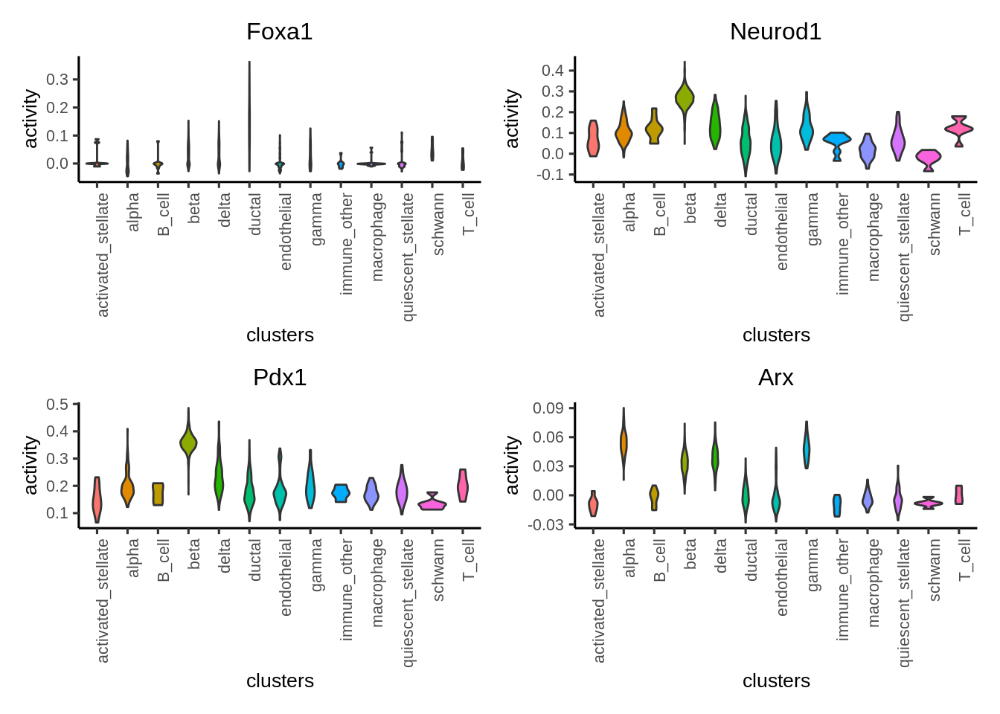
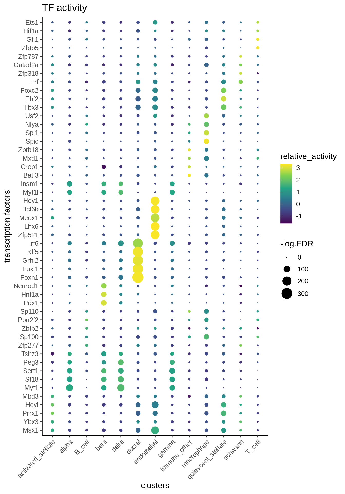
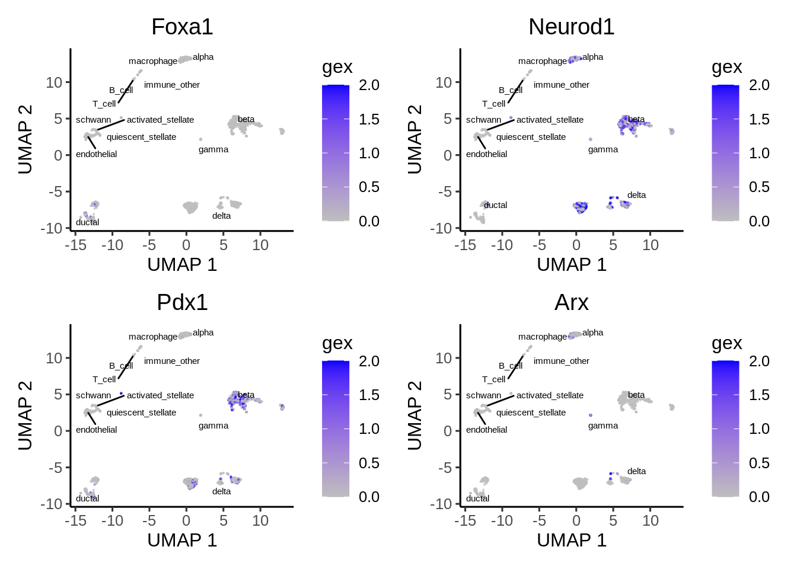
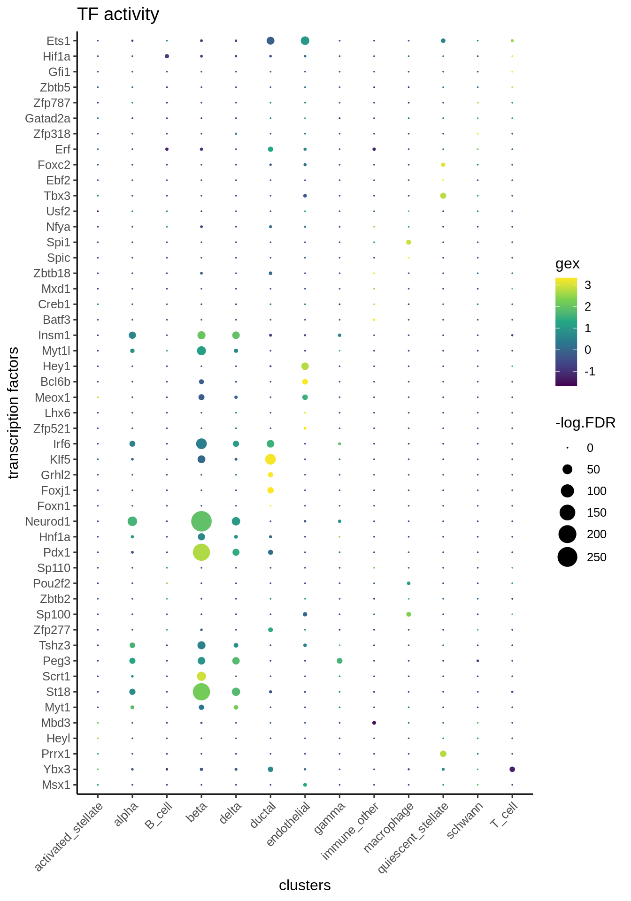
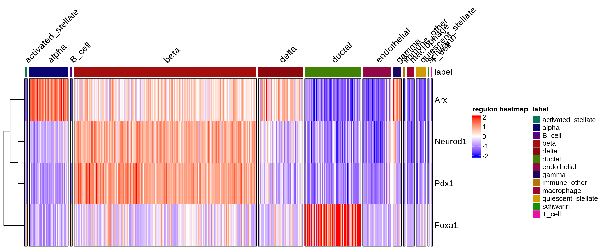

# Single modality: scRNA-seq only

Epiregulon also supports transcription factor activity inference when users only have scRNA-seq. After all, multiome or scATAC-seq data is still relatively rare. To enable TF activity inference on scRNA-seq, users can supply a pre-constructed gene regulatory network. [Dorothea](https://saezlab.github.io/dorothea/articles/dorothea.html) provides both human and mouse pre-constructed gene regulatory networks based on curated experimental and computational data. In this vignette, we bypass the regulon construction step and go straight to calculate TF activity from a Dorothea GRN.


## Load regulon

Dorothea assigns confidence level to its regulons with A being the most confident (i.e. supported by multiple lines of evidence) and E being the least confident. 


``` r
library(dorothea)
data(dorothea_mm, package = "dorothea")
regulon <- dorothea_mm 

#known tfs
genes_to_plot <- c("Foxa1", "Neurod1","Pdx1","Arx")
```


## Load scRNA-seq data

We download the raw counts of a mouse pancreas data set from  *[scRNAseq](https://bioconductor.org/packages/3.20/scRNAseq)*. We add normalized logcounts, perform dimension reduction and visualize the embeddings using *[scater](https://bioconductor.org/packages/3.20/scater)*. 


``` r
library(scRNAseq)
library(scater)

sce <- BaronPancreasData('mouse')
sce <- logNormCounts(sce)
sce <- runPCA(sce)
sce <- runUMAP(sce)

plotUMAP(sce, colour_by = "label", text_by = "label")
```


## Calculate activity

Even though Dorothea provides weights under the mor column, we can achieve superior performance if we recompute the weights based on the correlation between tf and target gene expression based on our own data. We performed 2 steps, the first step is to add weights to the Dorothea regulons and the second step is to estimate the TF activity by taking the weighted average of the target gene expression.


``` r
library(epiregulon)


#Add weights to regulon. Default method (wilcoxon) cannot be used
regulon.ms <- addWeights(regulon = regulon,
                         expMatrix = sce,
                         clusters = sce$label,
                         BPPARAM = BiocParallel::MulticoreParam(),
                         method="corr")

#Calculate activity
score.combine <- calculateActivity(sce, 
                                   regulon = regulon.ms, 
                                   mode = "weight", 
                                   method = "weightedMean")
```

## Perform differential activity

``` r
library(epiregulon.extra)
markers <- findDifferentialActivity(activity_matrix = score.combine, 
                                    clusters = sce$label, 
                                    pval.type = "some", 
                                    direction = "up", 
                                    test.type = "t")
```

Take the top TFs

``` r
markers.sig <- getSigGenes(markers, topgenes = 5 )
```


## Visualize activity

Finally we visualize the TF activity by either UMAP, violin plots or bubble plots. We confirm the activity of known lineage factors Pdx1 and Neurod1 in beta cells, Arx in alpha cells and Foxa1 in ductal cells.


``` r
# plot umap
plotActivityDim(sce = sce, 
                activity_matrix = score.combine,
                tf = genes_to_plot, 
                legend.label = "score",
                point_size = 0.1,
                dimtype = "UMAP", 
                label = "label", 
                combine = TRUE,
                text_size = 2)
```


``` r
# plot violin plot
plotActivityViolin(score.combine, 
                   tf = genes_to_plot,
                   clusters = sce$label)
```



``` r
# plot bubble plot
plotBubble(score.combine, 
           tf = genes_to_plot, 
           clusters = sce$label)
```


Plot bubble plot of differential TFs


``` r
plotBubble(score.combine, 
           tf = markers.sig$tf, 
           clusters = sce$label)
```



We can adapt the epiregulon package to plot gene expression. When compared against TF activity, gene expression of Foxa1 and Arx has noisy signals and high dropout rates. 
Epiregulon enhances the signal to noise ratio of TF activity and better resolves lineage differences.


``` r
# plot umap
plotActivityDim(sce = sce, 
                activity_matrix = logcounts(sce),
                tf = genes_to_plot, 
                legend.label = "gex",
                point_size = 0.1,
                dimtype = "UMAP", 
                label = "label", 
                combine = TRUE,
                text_size = 2,
                colors = c("gray","blue"),
                limit = c(0,2))
```



``` r
# plot violin plot
plotActivityViolin(logcounts(sce), 
                   tf = genes_to_plot,
                   clusters = sce$label,
                   legend.label = "gex")
```


``` r
# plot Bubble plot
plotBubble(logcounts(sce), 
           tf = markers.sig$tf, 
           clusters = sce$label,
           legend.label = "gex")
```



We can visualize the target genes for transcription factors of interest

``` r
plotHeatmapRegulon(sce=sce,
                   tfs=genes_to_plot,
                   regulon=regulon.ms,
                   regulon_cutoff=0.5,
                   downsample=1000,
                   cell_attributes="label",
                   col_gap="label",
                   exprs_values="logcounts",
                   name="regulon heatmap",
                   column_title_rot = 45)
```


``` r
plotHeatmapActivity(activity_matrix = score.combine,
                    sce=sce,
                    tfs=genes_to_plot,
                    downsample=1000,
                    cell_attributes="label",
                    col_gap="label",
                    name="regulon heatmap",
                    column_title_rot = 45)
```



## Pathway enrichment

Sometimes it is useful to understand what pathways are enriched in the regulons. We take the highly correlated target genes of a regulon and perform geneset enrichment using the enricher function from [clusterProfiler](http://yulab-smu.top/biomedical-knowledge-mining-book/universal-api.html).


``` r
#retrieve genesets
H <- EnrichmentBrowser::getGenesets(org = "mmu", 
                                    db = "msigdb", 
                                    cat = "H", 
                                    gene.id.type = "SYMBOL", 
                                    cache = FALSE)
C6 <- EnrichmentBrowser::getGenesets(org = "mmu", 
                                     db = "msigdb", 
                                     cat = "C6", 
                                     gene.id.type = "SYMBOL",  
                                     cache = FALSE)

#combine genesets and convert genesets to be compatible with enricher
gs <- c(H,C6)
gs.list <- do.call(rbind,lapply(names(gs), function(x) 
  {data.frame(gs = x, genes = gs[[x]])}))

enrichresults <- regulonEnrich(genes_to_plot, 
                               regulon = regulon.ms, 
                               weight = "weight",
                               weight_cutoff = 0.5, 
                               genesets = gs.list)
```

```
## Foxa1
```

```
## 
```

```
## Neurod1
```

```
## Pdx1
```

```
## Arx
```

``` r
#plot results
enrichPlot(results = enrichresults, ncol = 1)
```


## Session Info


``` r
sessionInfo()
```

```
## R version 4.4.0 (2024-04-24)
## Platform: x86_64-pc-linux-gnu
## Running under: Red Hat Enterprise Linux 8.6 (Ootpa)
## 
## Matrix products: default
## BLAS/LAPACK: /apps/rocs/2020.08/cascadelake/software/OpenBLAS/0.3.9-GCC-9.3.0/lib/libopenblas_skylakexp-r0.3.9.so;  LAPACK version 3.9.0
## 
## locale:
##  [1] LC_CTYPE=en_US.UTF-8       LC_NUMERIC=C              
##  [3] LC_TIME=en_US.UTF-8        LC_COLLATE=en_US.UTF-8    
##  [5] LC_MONETARY=en_US.UTF-8    LC_MESSAGES=en_US.UTF-8   
##  [7] LC_PAPER=en_US.UTF-8       LC_NAME=C                 
##  [9] LC_ADDRESS=C               LC_TELEPHONE=C            
## [11] LC_MEASUREMENT=en_US.UTF-8 LC_IDENTIFICATION=C       
## 
## time zone: America/Los_Angeles
## tzcode source: system (glibc)
## 
## attached base packages:
## [1] stats4    stats     graphics  grDevices utils     datasets  methods  
## [8] base     
## 
## other attached packages:
##  [1] org.Mm.eg.db_3.20.0         AnnotationDbi_1.67.0       
##  [3] msigdbr_7.5.1               epiregulon.extra_1.3.1     
##  [5] epiregulon_1.3.4            scater_1.33.4              
##  [7] ggplot2_3.5.1               scuttle_1.15.4             
##  [9] scRNAseq_2.19.1             SingleCellExperiment_1.27.2
## [11] SummarizedExperiment_1.35.4 Biobase_2.65.1             
## [13] GenomicRanges_1.57.2        GenomeInfoDb_1.41.2        
## [15] IRanges_2.39.2              S4Vectors_0.43.2           
## [17] BiocGenerics_0.51.3         MatrixGenerics_1.17.0      
## [19] matrixStats_1.4.1           dorothea_1.17.0            
## 
## loaded via a namespace (and not attached):
##   [1] fs_1.6.4                 ProtGenerics_1.37.1      bitops_1.0-9            
##   [4] enrichplot_1.25.3        httr_1.4.7               RColorBrewer_1.1-3      
##   [7] doParallel_1.0.17        Rgraphviz_2.49.1         tools_4.4.0             
##  [10] backports_1.5.0          alabaster.base_1.5.9     utf8_1.2.4              
##  [13] R6_2.5.1                 HDF5Array_1.33.8         lazyeval_0.2.2          
##  [16] uwot_0.2.2               rhdf5filters_1.17.0      GetoptLong_1.0.5        
##  [19] withr_3.0.1              gridExtra_2.3            cli_3.6.3               
##  [22] Cairo_1.6-2              scatterpie_0.2.4         alabaster.se_1.5.3      
##  [25] labeling_0.4.3           sass_0.4.9               KEGGgraph_1.65.0        
##  [28] yulab.utils_0.1.7        Rsamtools_2.21.2         gson_0.1.0              
##  [31] DOSE_3.99.1              R.utils_2.12.3           bcellViper_1.41.0       
##  [34] limma_3.61.12            rstudioapi_0.16.0        RSQLite_2.3.7           
##  [37] FNN_1.1.4.1              gridGraphics_0.5-1       generics_0.1.3          
##  [40] shape_1.4.6.1            BiocIO_1.15.2            dplyr_1.1.4             
##  [43] GO.db_3.20.0             Matrix_1.7-0             ggbeeswarm_0.7.2        
##  [46] fansi_1.0.6              abind_1.4-8              R.methodsS3_1.8.2       
##  [49] lifecycle_1.0.4          yaml_2.3.10              edgeR_4.3.19            
##  [52] qvalue_2.37.0            rhdf5_2.49.0             SparseArray_1.5.44      
##  [55] BiocFileCache_2.13.2     grid_4.4.0               blob_1.2.4              
##  [58] promises_1.3.0           dqrng_0.4.1              ExperimentHub_2.13.1    
##  [61] crayon_1.5.3             lattice_0.22-6           beachmat_2.21.6         
##  [64] cowplot_1.1.3            GenomicFeatures_1.57.1   annotate_1.83.0         
##  [67] chromote_0.3.1           KEGGREST_1.45.1          magick_2.8.5            
##  [70] pillar_1.9.0             knitr_1.48               ComplexHeatmap_2.21.1   
##  [73] metapod_1.13.0           fgsea_1.31.6             rjson_0.2.23            
##  [76] codetools_0.2-20         fastmatch_1.1-4          glue_1.8.0              
##  [79] ggfun_0.1.7              data.table_1.16.2        treeio_1.29.1           
##  [82] vctrs_0.6.5              png_0.1-8                gypsum_1.1.6            
##  [85] gtable_0.3.5             cachem_1.1.0             xfun_0.48               
##  [88] S4Arrays_1.5.10          tidygraph_1.3.1          iterators_1.0.14        
##  [91] statmod_1.5.0            bluster_1.15.1           nlme_3.1-166            
##  [94] ggtree_3.13.1            bit64_4.5.2              alabaster.ranges_1.5.2  
##  [97] filelock_1.0.3           bslib_0.8.0              irlba_2.3.5.1           
## [100] vipor_0.4.7              colorspace_2.1-1         DBI_1.2.3               
## [103] tidyselect_1.2.1         processx_3.8.4           bit_4.5.0               
## [106] compiler_4.4.0           curl_5.2.3               httr2_1.0.5             
## [109] graph_1.83.0             BiocNeighbors_1.99.2     DelayedArray_0.31.14    
## [112] shadowtext_0.1.4         bookdown_0.40            rtracklayer_1.65.0      
## [115] checkmate_2.3.2          scales_1.3.0             rappdirs_0.3.3          
## [118] stringr_1.5.1            digest_0.6.37            alabaster.matrix_1.5.10 
## [121] rmarkdown_2.28           XVector_0.45.0           htmltools_0.5.8.1       
## [124] pkgconfig_2.0.3          highr_0.11               dbplyr_2.5.0            
## [127] fastmap_1.2.0            ensembldb_2.29.1         rlang_1.1.4             
## [130] GlobalOptions_0.1.2      UCSC.utils_1.1.0         farver_2.1.2            
## [133] jquerylib_0.1.4          jsonlite_1.8.9           BiocParallel_1.39.0     
## [136] R.oo_1.26.0              GOSemSim_2.31.2          BiocSingular_1.21.4     
## [139] RCurl_1.98-1.16          magrittr_2.0.3           ggplotify_0.1.2         
## [142] GenomeInfoDbData_1.2.13  patchwork_1.3.0          Rhdf5lib_1.27.0         
## [145] munsell_0.5.1            Rcpp_1.0.13              ape_5.8                 
## [148] babelgene_22.9           viridis_0.6.5            EnrichmentBrowser_2.35.1
## [151] stringi_1.8.4            alabaster.schemas_1.5.0  ggraph_2.2.1            
## [154] zlibbioc_1.51.1          MASS_7.3-61              AnnotationHub_3.13.3    
## [157] plyr_1.8.9               parallel_4.4.0           ggrepel_0.9.6           
## [160] splines_4.4.0            Biostrings_2.73.2        graphlayouts_1.2.0      
## [163] circlize_0.4.16          locfit_1.5-9.10          ps_1.8.0                
## [166] igraph_2.0.3             reshape2_1.4.4           ScaledMatrix_1.13.0     
## [169] BiocVersion_3.20.0       XML_3.99-0.17            evaluate_1.0.1          
## [172] scran_1.33.2             BiocManager_1.30.25      foreach_1.5.2           
## [175] tweenr_2.0.3             tidyr_1.3.1              purrr_1.0.2             
## [178] polyclip_1.10-7          clue_0.3-65              alabaster.sce_1.5.1     
## [181] ggforce_0.4.2            rsvd_1.0.5               xtable_1.8-4            
## [184] restfulr_0.0.15          AnnotationFilter_1.29.0  tidytree_0.4.6          
## [187] later_1.3.2              viridisLite_0.4.2        tibble_3.2.1            
## [190] aplot_0.2.3              clusterProfiler_4.13.4   websocket_1.4.2         
## [193] memoise_2.0.1            beeswarm_0.4.0           GenomicAlignments_1.41.0
## [196] cluster_2.1.6            GSEABase_1.67.0          BiocStyle_2.33.1
```
